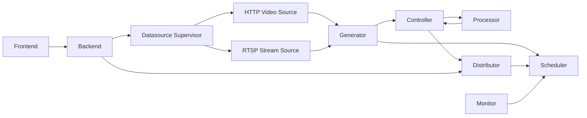

# API Docs

This section documents the service interfaces used by Dayu. It follows the implementation as it exists today rather than an aspirational external API standard.

## Service Map

| Component | Role | Interface type | Main code path |
| --- | --- | --- | --- |
| Backend | Control plane for policies, DAGs, datasource configs, deployment, runtime visualization, and log export | FastAPI, operator-facing | `backend/backend_server.py` |
| Scheduler | Produces runtime plans and stores resource state | FastAPI, internal | `dependency/core/scheduler/scheduler_server.py` |
| Controller | Receives tasks from generators and processor returns | FastAPI, internal | `dependency/core/controller/controller_server.py` |
| Processor | Per-service inference entrypoint and async worker loop | FastAPI, internal | `dependency/core/processor/processor_server.py` |
| Distributor | Stores task results, exposes incremental result queries, exports logs | FastAPI, internal | `dependency/core/distributor/distributor_server.py` |
| HTTP video source | Per-source data feeder for simulated `http_video` sources | FastAPI, dynamic internal API | `datasource/http_video.py` |
| RTSP stream source | Manifest-driven RTSP clip streamer for simulated `rtsp_video` sources | Internal process with RTSP output, no repository-managed HTTP API | `datasource/rtsp_video.py` |
| Datasource supervisor | Polls backend datasource state and starts or stops source processes | Internal loop, no public HTTP API | `datasource/datasource_server.py` |
| Generator | Pulls source data, requests schedules, and submits tasks | Internal entrypoint, no public HTTP API | `dependency/core/generator/generator_server.py` |
| Monitor | Samples resource data and posts it to scheduler | Internal loop, no public HTTP API | `dependency/core/monitor/monitor.py` |

## API Conventions

| Topic | Current behavior |
| --- | --- |
| Transport | FastAPI services with permissive CORS enabled on all routes. |
| Authentication | No built-in authentication or authorization layer is implemented in the current codebase. |
| Error style | Mixed. Many backend control-plane endpoints return `{state, msg}`; some runtime endpoints return plain values, arrays, serialized tasks, file streams, or `null`. |
| Binary payloads | Internal task transfer uses `multipart/form-data` with `file` for the binary payload and `data` for a serialized `Task`. |
| Serialized tasks | Internal services exchange `Task.serialize()` payloads. The exact schema is an internal contract defined in `core.lib.content.Task`. |
| GET with request body | Some internal endpoints currently use `GET` and still read JSON or form data from the request body. Documented behavior should be preserved for compatibility until a coordinated cleanup happens. |
| Visualization configs | Visualization hook selection is data-driven from YAML configs and not hard-coded in backend route handlers. |

## Runtime Flow

## Documents In This Section

| Document | Purpose |
| --- | --- |
| [`backend.md`](./backend.md) | Control-plane APIs used by the frontend, deployment flows, datasource management, visualization, and log export. |
| [`runtime-services.md`](./runtime-services.md) | Internal runtime APIs used between generator, controller, processor, distributor, scheduler, monitor, and datasource services. |

## Related Documents

- [`../datasource/README.md`](../datasource/README.md): datasource dataset layout, manifest schema, and frame-indexing behavior shared by `http_video` and `rtsp_video`.

## Stability Notes

- The backend API is the closest thing to a public repository contract today.
- Scheduler, controller, processor, distributor, and datasource routes should be treated as internal APIs. They are stable only to the extent needed by other Dayu components already in the repository.
- If you change an internal API, update both the server implementation and the calling component in the same change, then update these docs.
