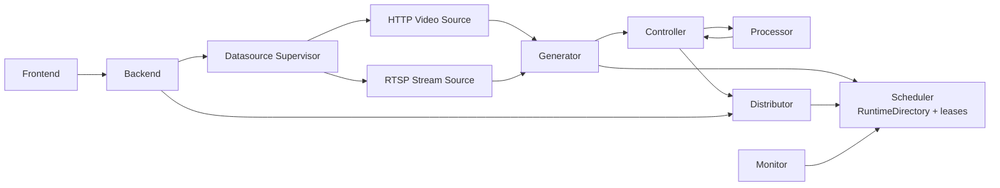

# API Docs

This section documents the service interfaces used by Dayu. It follows the implementation as it exists today rather than an aspirational external API standard.

## Service Map

| Component | Role | Interface type | Main code path |
| --- | --- | --- | --- |
| Backend | Control plane for policies, DAGs, datasource configs, deployment, runtime visualization, and log export | FastAPI, operator-facing | `backend/backend_server.py` |
| Scheduler | Produces plans, owns the versioned RuntimeDirectory/CAS, and stores task leases/resource state | FastAPI, internal | `dependency/core/scheduler/scheduler_server.py` |
| Controller | Receives tasks from generators and processor returns | FastAPI, internal | `dependency/core/controller/controller_server.py` |
| Processor | Per-service inference entrypoint and async worker loop | FastAPI, internal | `dependency/core/processor/processor_server.py` |
| Distributor | Stores task results, exposes incremental result queries, exports logs | FastAPI, internal | `dependency/core/distributor/distributor_server.py` |
| HTTP video source | Per-source data feeder for simulated `http_video` sources | FastAPI, dynamic internal API | `datasource/http_video.py` |
| RTSP stream source | Manifest-driven RTSP clip streamer for simulated `rtsp_video` sources | Internal process with RTSP output, no repository-managed HTTP API | `datasource/rtsp_video.py` |
| V4L2 video source | Real-camera generator getter for `v4l2_video` datasource configs | Internal generator hook, no datasource-supervisor HTTP API | `dependency/core/lib/algorithms/data_getter/v4l2_video_getter.py` |
| Datasource supervisor | Polls backend datasource state and starts or stops source processes | Internal loop, no public HTTP API | `datasource/datasource_server.py` |
| Generator | Pulls source data, requests schedules, and submits tasks | Internal entrypoint, no public HTTP API | `dependency/core/generator/generator_server.py` |
| Monitor | Samples resource data and posts it to scheduler | Internal loop, no public HTTP API | `dependency/core/monitor/monitor.py` |

## API Conventions

| Topic | Current behavior |
| --- | --- |
| Transport | Frontend calls Backend through its same-origin `/api` proxy; Backend does not grant cross-origin browser access. This is still transport scoping, not caller authentication. |
| Authentication | No built-in authentication or authorization layer is implemented. Namespace-scoped Kubernetes RBAC limits Backend resource access but does not authenticate HTTP callers. |
| Kubernetes boundary | Backend alone uses the Kubernetes Python client. Runtime APIs consume bootstrap, directory snapshots, and exact task routes. |
| Error style | Mixed. Many backend control-plane endpoints return `{state, msg}`; some runtime endpoints return plain values, arrays, serialized tasks, file streams, or `null`. |
| Binary payloads | Internal task transfer uses `multipart/form-data` with `file` for the binary payload and `data` for a serialized `Task`. |
| Serialized tasks | Internal services exchange `Task.serialize()` payloads. The exact schema is an internal contract defined in `core.lib.content.Task`. |
| GET with request body | Some non-runtime endpoints currently use `GET` with JSON/form data. The method and body documented here are the canonical current contract and must change together with all callers. |
| Visualization configs | Visualization hook selection is data-driven from YAML configs and not hard-coded in backend route handlers. |
| Scheduler execution | Scheduler runs as one direct Uvicorn process. Blocking Redis-backed directory and lease handlers are synchronous FastAPI endpoints and run in its thread pool instead of blocking the ASGI event loop. |

One namespace is one shared lifecycle and permission domain from Dayu's point of view. Every browser, script, or API
client that can reach the same Backend can observe and operate the same installation. `install_id` prevents a delayed
request from deleting a replacement generation; it is public lifecycle state and grants no authority. A multi-user
deployment must authenticate outside Dayu, route each principal to the intended namespace deployment, and restrict
direct Frontend and Backend NodePort access. Browser-local tokens, tabs, and storage are not isolation mechanisms.
The repository's frontend login/profile routing is presentation state only: it does not authenticate requests to
Backend and must not be used as evidence that an install or uninstall caller is authorized.

## Runtime Flow

```mermaid
flowchart LR
    FE["Frontend"] --> BE["Backend"]
    BE --> DS["Datasource Supervisor"]
    DS --> HVS["HTTP Video Source"]
    DS --> RVS["RTSP Stream Source"]
    G["Generator"] --> SCH["Scheduler\nRuntimeDirectory + leases"]
    G --> CTRL["Controller"]
    HVS --> G
    RVS --> G
    CTRL --> PROC["Processor"]
    PROC --> CTRL
    CTRL --> DIST["Distributor"]
    DIST --> SCH
    BE --> DIST
    MON["Monitor"] --> SCH
```

Generator acquires one revision/root-task lease before submission. Controller and processor follow the exact routes in
the Task without calling the lease API. Distributor performs the single final renewal before persistence, waits for
the Scheduler scenario acknowledgement, and then releases the lease. Exact controller/processor identities travel in
the serialized Task; no runtime API performs Kubernetes discovery.

## Documents In This Section

| Document | Purpose |
| --- | --- |
| [`backend.md`](./backend.md) | Control-plane APIs used by the frontend, deployment flows, datasource management, visualization, and log export. |
| [`runtime-services.md`](./runtime-services.md) | Internal runtime APIs used between generator, controller, processor, distributor, scheduler, monitor, and datasource services. |

## Related Documents

- [`../datasource/README.md`](../datasource/README.md): datasource dataset layout, manifest schema, and frame-indexing behavior shared by `http_video` and `rtsp_video`.
- [`../operations/README.md`](../operations/README.md): install/query/uninstall lifecycle behavior around backend APIs.

## Stability Notes

- The backend API is the closest thing to a public repository contract today.
- Scheduler, controller, processor, distributor, and datasource routes should be treated as internal APIs. They are stable only to the extent needed by other Dayu components already in the repository.
- If you change an internal API, update both the server implementation and the calling component in the same change, then update these docs.
