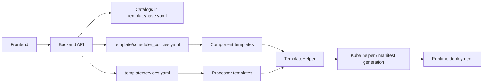
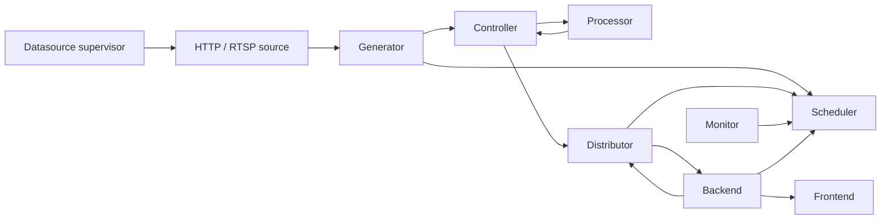

# Architecture Overview

This document explains how Dayu fits together as a system, not just as a collection of services. It is the best starting point if you are new to the repository and want to understand what each major directory and runtime component is for.

## What Dayu Is

Dayu is a cloud-edge stream analytics platform for DAG-based AI pipelines. Its core responsibilities are:

- deploying the runtime stack for a chosen scheduling policy
- binding one or more datasources to service DAGs
- scheduling data configuration and offloading decisions at runtime
- executing multi-stage AI services across heterogeneous nodes
- collecting result and system telemetry for visualization and export

In practice, Dayu combines three ideas:

- a control plane for installation, datasource selection, runtime status, and visualization
- a runtime collaboration layer for generator, scheduler, controller, processor, distributor, and monitor
- a hook-driven extension model that lets different research policies and runtime behaviors reuse the same service shells

## Architectural Planes

Mature distributed systems are easier to reason about when you separate control-plane concerns from runtime data flow. Dayu follows that model.

| Plane | Main components | Primary responsibility |
| --- | --- | --- |
| Control plane | `frontend`, `backend`, `backend/template_helper.py`, `template/` | User workflows, deployment composition, policy and datasource selection, runtime status, visualization, log export |
| Source plane | `datasource/datasource_server.py`, `datasource/http_video.py`, `datasource/rtsp_video.py`, `datasource/video_dataset.py` | Source simulation, manifest-driven playback, and source-process lifecycle |
| Runtime collaboration plane | `generator`, `scheduler`, `controller`, `processor`, `distributor`, `monitor` | Task creation, scheduling, transport, inference, result persistence, and resource reporting |
| Extension plane | `dependency/core/lib/algorithms/`, `dependency/core/applications/`, `template/processor/*.yaml` | Scheduling policies, runtime hooks, application services, visualization plugins |

## The Five-Layer Model In The Repository

The repository README describes Dayu as a five-layer system. The table below maps that conceptual model back to concrete code.

| Layer | Meaning in Dayu | Main code or config paths |
| --- | --- | --- |
| Basic system layer | Cluster substrate and runtime base provided by Kubernetes/KubeEdge | external infrastructure |
| Intermediate interface layer | Dayu's deployment bridge to Sedna and EdgeMesh | `backend/`, `hack/`, external Dayu Sedna/EdgeMesh repos |
| System support layer | Human-facing UI, backend orchestration, datasource simulation | `frontend/`, `backend/`, `datasource/` |
| Collaboration scheduling layer | Runtime workers coordinating stream execution | `dependency/core/{generator,scheduler,controller,distributor,monitor,processor}` and `components/` |
| Application service layer | Concrete AI services plugged into the runtime | `dependency/core/applications/`, `template/processor/`, `template/services.yaml` |

## Control-Plane Flow

The control plane is responsible for turning operator intent into a concrete deployment.

Key points:

- the backend does not hard-code one scheduling policy or one service graph
- scheduler policies are catalog entries that point at one scheduler template plus its dependent component templates
- processor services are catalog entries that point at processor templates
- datasource choice, DAG choice, and selected nodes are injected at install time

## Runtime Data Flow

Once the stack is deployed and a datasource is opened, the runtime path is driven by the collaboration components.

More concretely:

1. Backend opens a datasource through `/submit_query`.
2. Datasource supervisor starts `http_video` or `rtsp_video` source processes based on backend state.
3. Generator reads source data, asks scheduler for the next plan, and submits tasks to controller.
4. Controller forwards tasks into processors and later receives processed returns.
5. Distributor persists completed tasks and forwards scenario updates back to scheduler.
6. Monitor periodically reports resource state to scheduler.
7. Backend polls distributor and scheduler to produce frontend-facing result and system visualizations.

## Runtime Ownership By Component

| Component | Owns | Does not own |
| --- | --- | --- |
| Backend | install/query lifecycle, visualization config, log export, source state | low-level inference behavior |
| Datasource | source playback, manifest interpretation, clip or frame indexing | scheduling decisions |
| Generator | source segmentation, task creation, pre-schedule and pre-submit hooks | inference execution |
| Scheduler | policy state, resource state, source selection, deployment planning | task persistence |
| Controller | transport timing, task forwarding, return-path orchestration | scheduling or storage |
| Processor | AI inference, scenario extraction, queue discipline | deployment or visualization |
| Distributor | durable result storage, incremental result queries, export files | operator workflows |
| Monitor | resource sampling | task-level scheduling decisions |

## Extension Seams

The repository is intentionally structured around a few long-lived extension seams:

| Extension seam | Why it matters |
| --- | --- |
| Hook families in `dependency/core/lib/algorithms/` | Lets policy families and runtime behaviors evolve without rewriting service shells |
| Processor services in `dependency/core/applications/` plus `template/processor/*.yaml` | Lets new AI services join the platform with minimal changes to orchestration code |
| Datasource configs and manifests | Lets one runtime support synthetic clips, RTSP playback, and evaluation-oriented frame indexing |
| Visualization configs | Lets backend render different result and system dashboards without new route code |

## Where To Go Next

- [`../configuration/README.md`](../configuration/README.md): how the YAML and env configuration model works
- [`../api/README.md`](../api/README.md): route-level API references
- [`../hooks/README.md`](../hooks/README.md): hook lifecycle and registration model
- [`../development/README.md`](../development/README.md): contributor-oriented repository map and workflows
