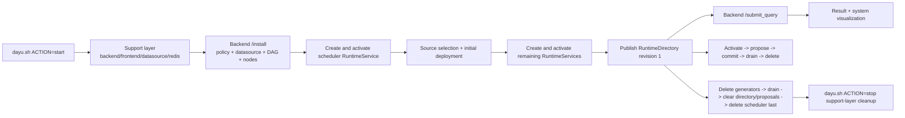
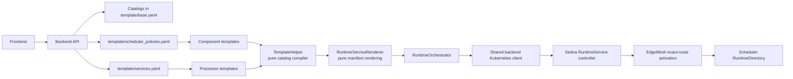
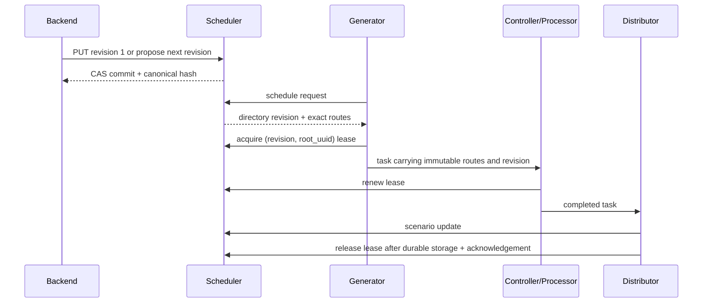
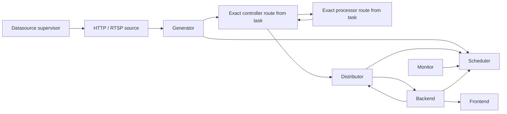

# Architecture Overview

This document explains how Dayu fits together as a system, not just as a collection of services. It is the best starting point if you are new to the repository and want to understand what each major directory and runtime component is for.

## What Dayu Is

Dayu is a cloud-edge stream analytics platform for DAG-based AI pipelines. Its core responsibilities are:

- deploying the runtime stack for a chosen scheduling policy
- binding one or more datasources to service DAGs
- scheduling data configuration and offloading decisions at runtime
- executing multi-stage AI services across heterogeneous nodes
- collecting result and system telemetry for visualization and export

The core of the project is the separation between a stable runtime skeleton and dynamically selected policy/application
behavior. Backend, generator, scheduler, controller, processor, distributor, and monitor keep the execution loop stable;
templates, catalogs, and hooks decide which datasource, service DAG, processor implementations, scheduling policy, and
visualizers are active for one install.

In practice, Dayu combines three ideas:

- a control plane for installation, datasource selection, runtime status, and visualization
- a runtime collaboration layer for generator, scheduler, controller, processor, distributor, and monitor
- a hook-driven extension model that lets different research policies and runtime behaviors reuse the same service shells

## Architectural Planes

Mature distributed systems are easier to reason about when you separate control-plane concerns from runtime data flow. Dayu follows that model.

| Plane | Main components | Primary responsibility |
| --- | --- | --- |
| Control plane | `frontend`, `backend`, `backend/runtime_orchestrator.py`, `backend/runtime_service_client.py`, `template/` | User workflows, pure deployment composition, the only Python Kubernetes access, runtime publication, visualization, log export |
| Source plane | `datasource/datasource_server.py`, `datasource/http_video.py`, `datasource/rtsp_video.py`, `datasource/video_dataset.py` | Source simulation, manifest-driven playback, and source-process lifecycle |
| Runtime collaboration plane | `generator`, `scheduler`, `controller`, `processor`, `distributor`, `monitor`, `dependency/core/lib/scheduling/` | Task creation, scheduling contracts, transport, inference, result persistence, and resource reporting |
| Extension plane | `dependency/core/lib/algorithms/`, `dependency/core/applications/`, `template/processor/*.yaml` | Scheduling policies, runtime hooks, application services, visualization plugins |

## Lifecycle At A Glance

Dayu has a two-layer deployment lifecycle and one explicit publication boundary:


```mermaid
flowchart LR
    START["dayu.sh ACTION=start"] --> SUPPORT["Support layer\nbackend/frontend/datasource/redis"]
    SUPPORT --> INSTALL["Backend /install\npolicy + datasource + DAG + nodes"]
    INSTALL --> SCHEDULER["Create and activate scheduler RuntimeService"]
    SCHEDULER --> DECIDE["Source selection + initial deployment"]
    DECIDE --> RUNTIME["Create and activate remaining RuntimeServices"]
    RUNTIME --> DIRECTORY["Publish RuntimeDirectory revision 1"]
    DIRECTORY --> QUERY["Backend /submit_query"]
    QUERY --> RESULTS["Result + system visualization"]
    DIRECTORY --> REDEPLOY["Activate -> propose -> commit -> drain -> delete"]
    DIRECTORY --> STOP["Delete generators -> drain -> clear directory/proposals -> delete scheduler last"]
    STOP --> CLEAN["dayu.sh ACTION=stop support-layer cleanup"]
```

Key boundaries:

- `dayu.sh` starts the platform support layer. It does not choose an application DAG or scheduler policy.
- Backend `/install` preflights one node snapshot plus Sedna LC and EdgeMesh agent readiness, then installs the
  scheduler first because install-time selection and deployment decisions are scheduler APIs.
- A worker is publishable only after Sedna reports the expected revision/spec plus exact RuntimeService, Service, and
  Pod identities with both `Activated=True` and `Ready=True`.
- Scheduler owns the canonical, versioned `RuntimeDirectory`, persisted with proposal/CAS state in Redis so a
  Scheduler Pod restart preserves the active route authority. Runtime workers resolve controller and processor
  endpoints from the exact routes copied into each task; they never perform Kubernetes discovery.
- Scheduler and its policy plugins share the canonical deployment-plan boundary in
  `dependency/core/lib/scheduling/deployment_plan.py`; `algorithms/` contains implementations, not framework contracts.
- Backend may compose the optional `default-cloud-processor-backup` replica only after that plan is complete and
  valid. The policy result remains unchanged, while the published RuntimeDirectory records the operational replica's
  exact routable identity for subsequent scheduling.
- Backend `/submit_query` opens one datasource label and starts result collection.
- Processor redeployment creates a new immutable revision, commits it with compare-and-swap, drains task leases on the
  previous directory revision, and only then deletes retired RuntimeServices.
- Backend `/stop_service` stops generators first, drains all active/pending revisions, atomically clears the
  install-scoped active directory plus pending proposals, deletes the now-unroutable workers, and deletes scheduler last.
  `dayu.sh ACTION=stop` refuses destructive fallback while runtimes remain unless
  `FORCE_RUNTIME_STOP=true` explicitly abandons in-flight work.

## The Five-Layer Model In The Repository

The repository README describes Dayu as a five-layer system. The table below maps that conceptual model back to concrete code.

| Layer | Meaning in Dayu | Main code or config paths |
| --- | --- | --- |
| Basic system layer | Cluster substrate and runtime base provided by Kubernetes/KubeEdge | external infrastructure |
| Intermediate interface layer | Immutable Sedna RuntimeServices and exact EdgeMesh activation | `backend/runtime_*.py`, external Dayu Sedna/EdgeMesh repos |
| System support layer | Human-facing UI, backend orchestration, datasource simulation | `frontend/`, `backend/`, `datasource/` |
| Collaboration scheduling layer | Runtime workers coordinating stream execution | `dependency/core/{generator,scheduler,controller,distributor,monitor,processor}` and `components/` |
| Application service layer | Concrete AI services plugged into the runtime | `dependency/core/applications/`, `template/processor/`, `template/services.yaml` |

## Control-Plane Flow

The control plane is responsible for turning operator intent into a concrete deployment.


```mermaid
flowchart LR
    FE["Frontend"] --> BE["Backend API"]
    BE --> CAT["Catalogs in template/base.yaml"]
    BE --> POL["template/scheduler_policies.yaml"]
    BE --> SVC["template/services.yaml"]
    POL --> TPL["Component templates"]
    SVC --> PROC["Processor templates"]
    TPL --> HELPER["TemplateHelper\npure catalog compiler"]
    PROC --> HELPER
    HELPER --> RENDER["RuntimeServiceRenderer\npure manifest rendering"]
    RENDER --> ORCH["RuntimeOrchestrator"]
    ORCH --> KUBE["Shared backend Kubernetes client"]
    KUBE --> SEDNA["Sedna RuntimeService controller"]
    SEDNA --> MESH["EdgeMesh exact-route activation"]
    MESH --> DIR["Scheduler RuntimeDirectory"]
```

Key points:

- the backend does not hard-code one scheduling policy or one service graph
- scheduler policies are catalog entries that point at one scheduler template plus its dependent component templates
- processor services are catalog entries that point at processor templates
- datasource choice, DAG choice, and selected nodes are injected at install time
- `TemplateHelper` and `RuntimeServiceRenderer` are pure: they do not load cluster configuration or call Kubernetes
- `ClusterClient` loads in-cluster configuration once and owns the sole reusable `ApiClient`; `RuntimeServiceClient`
  and `RuntimeSessionStore` require its injected API handles and cannot create independent clients; runtime
  containers do not install or import the Kubernetes Python package
- the compact transaction record is stored in the `dayu-runtime-session` ConfigMap with Kubernetes
  `resourceVersion` compare-and-swap; no local manifest file is a lifecycle source of truth
- Scheduler stores the active RuntimeDirectory, proposals, and task leases in support Redis. `dayu.sh` mounts Redis
  `/data` on the cloud host and enables AOF with `appendfsync=always`, so Scheduler and Redis Pod replacement do not
  erase committed routing state when that host path remains available
- graceful uninstall calls `DELETE /runtime-directory` with the exact install id after drain and before Scheduler
  deletion. Redis uses the install-scoped proposal index to atomically delete the active snapshot, every pending
  proposal, and the index itself. A mismatched install id fails closed; repeating an already-cleared request is safe

## Runtime Routing And Task Ownership

Runtime Pods receive `DAYU_RUNTIME_BOOTSTRAP` with immutable install metadata, the scheduler/Redis support endpoints,
compact node metadata, and a task-lease TTL. Bootstrap is not a topology cache. The scheduler's committed directory is
the route authority. In production the directory is Redis-backed rather than process memory:


```mermaid
sequenceDiagram
    participant BE as Backend
    participant S as Scheduler
    participant G as Generator
    participant W as Controller/Processor
    participant D as Distributor
    BE->>S: PUT revision 1 or propose next revision
    S-->>BE: CAS commit + canonical hash
    G->>S: schedule request
    S-->>G: directory revision + exact routes
    G->>S: acquire (revision, root_uuid) lease
    G->>W: task carrying immutable routes and revision
    W->>S: renew lease
    W->>D: completed task
    D->>S: scenario update
    D->>S: release lease after durable storage + acknowledgement
```

There is no route fallback. Missing, ambiguous, stale, or incomplete route identity is a hard runtime error. This is
what removes edge-side Pod/Node/Service list calls and the refresh races that came with per-process caches.

## Runtime Data Flow

Once the stack is deployed and a datasource is opened, the runtime path is driven by the collaboration components.


```mermaid
flowchart LR
    DS["Datasource supervisor"] --> SRC["HTTP / RTSP source"]
    SRC --> GEN["Generator"]
    GEN --> SCH["Scheduler"]
    GEN --> CTRL["Exact controller route from task"]
    CTRL --> PROC["Exact processor route from task"]
    PROC --> CTRL
    CTRL --> DIST["Distributor"]
    DIST --> SCH
    MON["Monitor"] --> SCH
    BE["Backend"] --> DIST
    BE --> SCH
    DIST --> BE
    BE --> FE["Frontend"]
```

More concretely:

1. Backend opens a datasource through `/submit_query`.
2. Datasource supervisor starts `http_video` or `rtsp_video` source processes based on backend state.
3. Generator reads source data, asks scheduler for a plan plus compact exact routes, acquires the task lease, and
   copies the directory revision/routes into the task before submission.
4. Controller and processor use only those task routes and renew the same lease as the task advances.
5. Distributor persists the completed task, obtains scheduler acknowledgement, then releases the lease.
6. Monitor periodically reports resource state to scheduler.
7. Backend polls distributor and scheduler to produce frontend-facing result and system visualizations.

## Runtime Ownership By Component

| Component | Owns | Does not own |
| --- | --- | --- |
| Backend | Kubernetes access, validated plan composition, RuntimeService/session lifecycle, install/query lifecycle, visualization, source state | task routing or low-level inference behavior |
| Datasource | source playback, manifest interpretation, clip or frame indexing | scheduling decisions |
| Generator | source segmentation, task creation, pre-schedule and pre-submit hooks | inference execution |
| Scheduler | policy/resource state, source/deployment plans, persistent-AOF Redis RuntimeDirectory CAS and revision leases | Kubernetes discovery, Pod/RuntimeService recovery, or result persistence |
| Controller | transport timing, task forwarding, return-path orchestration | scheduling or storage |
| Processor | AI inference, scenario extraction, queue discipline | deployment or visualization |
| Distributor | durable result storage, incremental result queries, export files | operator workflows |
| Monitor | resource sampling through committed local routes | Kubernetes discovery or task-level scheduling decisions |

## Runtime Content Contract

Processor services exchange a single content envelope:

```json
{
  "service": "service-name",
  "outputs": {},
  "profile": {
    "frame_count": 0
  }
}
```

This contract is intentionally narrow. Applications return service-specific `outputs`, and processor shells add the
envelope and compact profile. The scheduler and visualizers should consume this shape instead of relying on
service-local ad hoc fields.

## Extension Seams

The repository is intentionally structured around a few long-lived extension seams:

| Extension seam | Why it matters |
| --- | --- |
| Hook families in `dependency/core/lib/algorithms/` | Lets policy families and runtime behaviors evolve without rewriting service shells |
| Processor services in `dependency/core/applications/` plus `template/processor/*.yaml` | Lets new AI services join the platform with minimal changes to orchestration code |
| Datasource configs and manifests | Lets one runtime support synthetic clips, RTSP playback, and evaluation-oriented frame indexing |
| Visualization configs | Lets backend render different result and system dashboards without new route code |

## Where To Go Next

- [`../repository-quickstart.md`](../repository-quickstart.md): repository-local orientation and validation path
- [`../concepts.md`](../concepts.md): vocabulary shared by code, templates, APIs, and tests
- [`../configuration/README.md`](../configuration/README.md): how the YAML and env configuration model works
- [`../api/README.md`](../api/README.md): route-level API references
- [`../hooks/README.md`](../hooks/README.md): hook lifecycle and registration model
- [`../operations/README.md`](../operations/README.md): start/stop, install, query, redeploy, and cleanup behavior
- [`../development/README.md`](../development/README.md): contributor-oriented repository map and workflows
