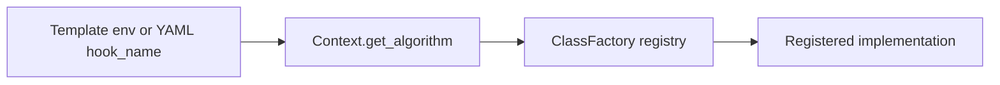

# Core Concepts

This page defines the vocabulary used across Dayu code, templates, APIs, and tests. It is intentionally shorter than
the API and configuration references: use it to build the mental model before jumping into implementation details.

## System Boundary

Dayu is not a single model-serving service. It is a cloud-edge runtime for DAG-shaped stream analytics:

- the control plane installs and supervises runtime components
- datasource adapters feed video streams or camera frames into the runtime
- generator creates tasks from source data
- scheduler decides task configuration, offloading, source placement, and processor deployment
- controller forwards tasks to processors and routes processed returns
- processors run AI services and write structured content back to the task
- distributor persists finished tasks and exposes result queries
- monitor reports resource state back to scheduler

## DAG

A Dayu DAG is the user-facing application workflow. It says which services exist and which service outputs feed later
services.

The repository accepts `.dag` files shaped as JSON. The logical DAG is in the `dag` field, while optional frontend
layout information is in `layout`.

Important rule: current frontend and backend validation use service ids as node ids. In normal repository examples,
the node key, node `id`, and `service_id` are the same string.

## Service Catalog Entry

`template/services.yaml` is the service catalog. A service entry connects a user-facing service id to a processor
template:

```yaml
- id: traffic-detection
  service: traffic-detection
  input: [frame]
  output: [bbox]
  yaml: traffic-detection.yaml
```

`input` and `output` are payload-form labels, not business semantics. Labels such as `frame`, `bbox`, `text`,
`segmentation`, `track`, `attribute`, `trajectory`, `pose`, and `graph` describe the shape of content that can flow
between services.

## Processor Template

A processor template under `template/processor/` describes how one logical service runs. It selects the processor shell
and service-local parameters through environment variables.

Common forms:

| Processor shell | Typical use |
| --- | --- |
| `detector_processor` | Frame-to-bounding-box detection. |
| `detector_tracker_processor` | Detection on the first frame and tracking on later frames. |
| `classifier_processor` | Classification over upstream bounding boxes. |
| `roi_classifier_processor` | ROI-aware classification with per-ROI caching. |
| `structured_processor` | New structured applications that consume predecessor content and return service-specific outputs. |

## Task Content Envelope

Processor outputs share one envelope:

```json
{
  "service": "traffic-detection",
  "outputs": {
    "bbox": [
      {
        "frame_index": 0,
        "items": []
      }
    ]
  },
  "profile": {
    "frame_count": 1
  }
}
```

The implementation contract lives in `dependency/core/processor/processor.py`:

- `service` is the current service name
- `outputs` is a dictionary from form label to record list
- every output record has `frame_index` and `items`
- `profile` currently allows only `frame_count`

Structured application classes return only `outputs`; `structured_processor` adds `service` and `profile`.

## Scheduler Policy

A scheduler policy is an install-time catalog entry in `template/scheduler_policies.yaml`. It chooses:

- one scheduler template from `template/scheduler/`
- dependent generator, controller, distributor, and monitor templates
- scheduler hooks and parameters through environment variables inside those templates

The policy id is what backend `/install` receives as `policy_id`.

## Hook Alias

A hook alias is a runtime-selectable implementation registered with `ClassFactory`. Templates and visualization configs
select aliases through fields such as `SCH_AGENT_NAME`, `GEN_FILTER_NAME`, `PROCESSOR_NAME`, `MONITORS`, or
visualization `hook_name`.

The resolution path is:



Use [`hooks/catalog.md`](./hooks/catalog.md) as the code-backed alias index.

## Datasource Config and Dataset Manifest

Datasource configuration has two layers:

| Layer | Example | Meaning |
| --- | --- | --- |
| Backend-facing datasource config | `config/datasource_configs/*.yaml` | What source labels and source modes the backend/frontend can choose. |
| Source-runtime manifest | `<dataset>/http_video/manifest.json` or `<dataset>/rtsp_video/manifest.json` | How a concrete dataset is played and how frame indices map to ground truth. |

`source_mode` selects the generator getter family. Repository examples include simulated `http_video`, simulated
`rtsp_video`, and real-camera `v4l2_video`.

## Deployment Resource

Runtime components are rendered as Sedna `JointMultiEdgeService` resources by `backend/template_helper.py`. Backend
annotates runtime resources with labels such as:

- `app.kubernetes.io/part-of=dayu`
- `app.kubernetes.io/managed-by=dayu-backend`
- `dayu.io/runtime-scope=installation`
- `dayu.io/install-id=<uuid>`
- `dayu.io/component=<component>`

Those labels make uninstall recoverable from live Kubernetes state even if the backend-local `resources.yaml` cache is
missing.

## Query

A query opens one datasource label after the runtime stack is installed. While the datasource is open:

1. datasource or camera input feeds generator
2. generator emits tasks
3. runtime services process and store results
4. backend polls distributor and renders visualization hooks

Only one datasource label is open at a time in the current backend state model. Reopening the same datasource is
idempotent; opening a different datasource requires `/stop_query` first.
