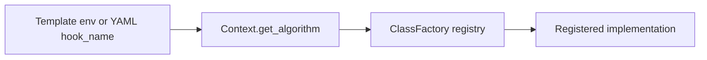

# Core Concepts

This page defines the vocabulary used across Dayu code, templates, APIs, and tests. It is intentionally shorter than
the API and configuration references: use it to build the mental model before jumping into implementation details.

## System Boundary

Dayu is not a single model-serving service. It is a cloud-edge runtime for DAG-shaped stream analytics:

- the control plane installs and supervises runtime components
- datasource adapters feed video streams or camera frames into the runtime
- generator creates tasks from source data
- scheduler decides task configuration, offloading, source placement, and processor deployment
- controller forwards tasks to processors and routes processed returns
- processors run AI services and write structured content back to the task
- distributor persists finished tasks and exposes result queries
- monitor reports resource state back to scheduler

## DAG

A Dayu DAG is the user-facing application workflow. It says which services exist and which service outputs feed later
services.

The repository accepts `.dag` files shaped as JSON. The logical DAG is in the `dag` field, while optional frontend
layout information is in `layout`.

Important rule: current frontend and backend validation use service ids as node ids. In normal repository examples,
the node key, node `id`, and `service_id` are the same string.

## Service Catalog Entry

`template/services.yaml` is the service catalog. A service entry connects a user-facing service id to a processor
template:

```yaml
- id: traffic-detection
  service: traffic-detection
  input: [frame]
  output: [bbox]
  yaml: traffic-detection.yaml
```

`input` and `output` are payload-form labels, not business semantics. Labels such as `frame`, `bbox`, `text`,
`segmentation`, `track`, `attribute`, `trajectory`, `pose`, and `graph` describe the shape of content that can flow
between services.

## Processor Template

A processor template under `template/processor/` describes how one logical service runs. It selects the processor shell
and service-local parameters through environment variables.

Common forms:

| Processor shell | Typical use |
| --- | --- |
| `detector_processor` | Frame-to-bounding-box detection. |
| `detector_tracker_processor` | Detection on the first frame and tracking on later frames. |
| `classifier_processor` | Classification over upstream bounding boxes. |
| `roi_classifier_processor` | ROI-aware classification with per-ROI caching. |
| `structured_processor` | New structured applications that consume predecessor content and return service-specific outputs. |

## Task Content Envelope

Processor outputs share one envelope:

```json
{
  "service": "traffic-detection",
  "outputs": {
    "bbox": [
      {
        "frame_index": 0,
        "items": []
      }
    ]
  },
  "profile": {
    "frame_count": 1
  }
}
```

The implementation contract lives in `dependency/core/processor/processor.py`:

- `service` is the current service name
- `outputs` is a dictionary from form label to record list
- every output record has `frame_index` and `items`
- `profile` currently allows only `frame_count`

Structured application classes return only `outputs`; `structured_processor` adds `service` and `profile`.

## Scheduler Policy

A scheduler policy is an install-time catalog entry in `template/scheduler_policies.yaml`. It chooses:

- one scheduler template from `template/scheduler/`
- dependent generator, controller, distributor, and monitor templates
- scheduler hooks and parameters through environment variables inside those templates

The policy id is what backend `/install` receives as `policy_id`.

Source placement and processor placement have separate permission sets. `node_set` is the immutable per-source
processor candidate set. Backend also persists `source_candidate_nodes`: for `selected_edge_nodes` it is that source's
`node_set`; for `all_edge_nodes` it is every Ready edge node covered by Ready Sedna LC and EdgeMesh agents in the one
install-time cluster snapshot. Scheduler policies consume this injected list and never discover or expand it. Backend
validates the returned source against `source_candidate_nodes`, so a generator may legally run outside the processor
set without weakening the control-plane boundary. A fixed hostname or position outside its permitted list fails
explicitly; it is never replaced with the first node.

Initial-deployment and redeployment hooks return one canonical shape: each current-DAG logical service maps to a
non-empty JSON list of exact candidate node names. `dependency/core/lib/scheduling/deployment_plan.py` owns extraction,
normalization, and validation of this contract for both Scheduler and every policy family. It rejects missing or extra
services, scalar placements, empty targets, and nodes outside the processor candidate set. Scheduler and policy
plugins never infer cloud placement. After the plan is valid, Backend may apply the independent
`default-cloud-processor-backup` control by adding the exact resolved cloud node to every logical service. That
operational replica does not relax or rewrite the Scheduler policy contract.

## Hook Alias

A hook alias is a runtime-selectable implementation registered with `ClassFactory`. Templates and visualization configs
select aliases through fields such as `SCH_AGENT_NAME`, `GEN_FILTER_NAME`, `PROCESSOR_NAME`, `MONITORS`, or
visualization `hook_name`.

The resolution path is:



Use [`hooks/catalog.md`](./hooks/catalog.md) as the code-backed alias index.

## Datasource Config and Dataset Manifest

Datasource configuration has two layers:

| Layer | Example | Meaning |
| --- | --- | --- |
| Backend-facing datasource config | `config/datasource_configs/*.yaml` | What source labels and source modes the backend/frontend can choose. |
| Source-runtime manifest | `<dataset>/http_video/manifest.json` or `<dataset>/rtsp_video/manifest.json` | How a concrete dataset is played and how frame indices map to ground truth. |

`source_mode` selects the generator getter family. Repository examples include simulated `http_video`, simulated
`rtsp_video`, and real-camera `v4l2_video`.

## Runtime Slot, Unit, And Revision

A runtime slot is the stable logical identity of one worker. It combines component, target node, position, and, when
applicable, logical service or source id. A runtime unit is one immutable Sedna `RuntimeService` incarnation of that
slot at a positive deployment revision.

Every application worker is rendered as `sedna.io/v1alpha1`, kind `RuntimeService`. A RuntimeService owns one
single-replica Pod and, for routable components, one ClusterIP Service. The backend publishes a unit only after Sedna
observes the immutable spec and reports both `Activated=True` and `Ready=True` for the exact RuntimeService UID, Service
UID, and Pod UID. Updating a unit in place is not a deployment operation; a changed spec creates a new revision.

`JointMultiEdgeService` remains a support-layer mechanism used by `dayu.sh` for backend, frontend, Redis, and optional
datasource resources. It is not an application runtime resource.

## Runtime Directory

`RuntimeDirectory` is the Scheduler-owned route authority. Each committed snapshot contains:

- one installation id and monotonically increasing directory revision
- canonical node and logical processor deployment views
- one exact route per active runtime slot
- immutable RuntimeService/Service/Pod identities for every endpoint route
- a canonical content hash used for readback verification

The first directory is published only after the complete runtime is activated. Later processor changes use a
proposal followed by compare-and-swap commit against the expected base revision. Missing or ambiguous routes fail
closed; a worker never falls back to Kubernetes discovery or a bootstrap endpoint.

Production Scheduler persists the active snapshot and expiring proposals in Redis; task admission records and leases
use install/revision-scoped Redis hashes and ZSETs. The support Redis uses a host-mounted append-only file with
synchronous fsync, so this state survives
Scheduler or Redis Pod replacement while the cloud-node host path is retained. Process memory is used only by tests or
an explicitly constructed local harness. A production Scheduler with no bootstrap Redis endpoint fails at startup.
Scheduler itself runs as one direct Uvicorn process. Its synchronous Redis-backed directory and lease endpoints execute
in FastAPI's thread pool, so blocking Redis I/O cannot starve the ASGI event loop; there is no second supervisor
worker-heartbeat timeout that can mistake a delayed notification for a dead Scheduler.

During uninstall, Backend stops generators, immediately fences every relevant revision with `deadline=now`, and then
calls `DELETE /runtime-directory` with the exact install id without waiting for lease release. Scheduler atomically
removes the active snapshot, every pending proposal tracked by the install-scoped proposal index, and the index itself;
an install-id mismatch is rejected. The request is idempotent when this state is already absent. Task-lease keys are
separate. Scheduler failure cannot make them an uninstall lock because Backend proceeds with complete exact-UID
teardown. After the best-effort fence and clear, Scheduler itself is deleted before the remaining workers; this is the
definitive admission fence when its metadata APIs were unavailable. RuntimeService deletion uses UID preconditions and
`Foreground` propagation. Apiserver acceptance starts deletion but is not lifecycle completion: Backend retains the
RuntimeSession and observes the old install's RuntimeServices, Deployments, ReplicaSets, Pods, Services, Endpoints, and
EndpointSlices. Only a complete empty snapshot removes the Session and reopens install admission. An unchanged resource
set eventually produces a persistent delayed warning while reconciliation continues with backoff; it is not a timeout
that force-deletes resources or pretends uninstall succeeded.

## Runtime Session

Backend persists the control-plane transaction in the `dayu-runtime-session` ConfigMap. The compact record includes
the install/operation ids, phase, active directory revision, active/pending RuntimeService identities, normalized
source deployment, at most one lease-protected retirement, an exact-UID rollout cleanup backlog, and durable uninstall
progress containing timestamps plus the remaining Kubernetes object identities. During the crash-sensitive
`publishing-rollout` phase, the retirement first records the old revision and exact ownership with no deadline. The
Scheduler proposal commit then atomically switches routes, creates the immutable deadline, and clamps old leases;
Backend persists that returned deadline and fencing result when it finalizes the session. After the deadline, deletion
failures move to `cleanup` so they remain owned and retryable without blocking a later rollout. Writes use ConfigMap
`resourceVersion` compare-and-swap, so concurrent backend lifecycle operations cannot silently overwrite each other.

This ConfigMap is the backend transaction record. Runtime routing is read from Scheduler, and there is no backend-local
manifest file or cache to refresh.

## Runtime Bootstrap And Task Lease

`DAYU_RUNTIME_BOOTSTRAP` contains immutable install context and support endpoints needed to start a worker. It does not
contain a mutable route cache. After an ingestion round is permitted, Generator reserves a root `TaskIdentity`, sends
it to Scheduler as `task_context`, applies the returned plan, and only then materializes source data into a Task with
that same identity. It also copies the committed directory revision, exact routes, schedule decision id, and plan
digest into the Task; forks preserve all root-level scheduling fields.

For a task-aware schedule, Scheduler first stores a short-lived `pending` record containing the exact returned decision
and plan. The task is then protected by a lease keyed by `(directory_revision, root_uuid)`. Generator acquires it once
before first submission and attaches a commitment containing the immutable identity, DAG mapping, metadata, and
decision attribution. Admission verifies the reserved decision fields and atomically promotes the record to `active`.
Retrying the same task-aware scheduling request replays its pending decision instead of advancing the agent twice.
Scheduler keeps active records synchronized with lease renewal, expiry, release, and retirement. It makes copied
pending/active records available to every schedule agent together with resource telemetry and exact snapshots of
known Redis task barriers. A transient admission failure retains the already
materialized task and applies source backpressure; only
an explicit retired-revision fence rejects it and requests a fresh schedule. Controller and Processor do not access
the lease API. Distributor renews once immediately before durable result persistence and then performs Scheduler
scenario feedback and release as post-persistence completion work. The normal TTL covers end-to-end processing.
Redeployment gives the previous revision a bounded immutable deadline that clamps every old lease and remains the hard
upper bound; expiry revokes any remainder and releases the rollout gate. Uninstall does not wait for lease count or
expiry: it requests an immediate fence and proceeds with exact-UID administrative teardown.

`simple` queue means queued Task metadata is never intentionally evicted, but end-to-end ownership also requires its
media artifact and every network handoff. Dayu therefore uses the existing lease identity for one immutable node-local
artifact, publishes uploads atomically, and transfers Task ownership only after an exact task-UUID ACK. A Processor
requeues inference failures, retains a computed result while Controller is unavailable, and never treats `200 null` as
success. Its queue snapshot changes atomically with enqueue, dequeue, requeue, completion, and clearing, and reports
ordered waiting identities plus the running processing/handoff phase. Parallel join arrivals are idempotent by
predecessor, remain in Redis until their merged next hop is acknowledged, and are queryable through exact known keys.
Artifacts with no progress for one full lease TTL are reclaimed by the Controller cleaner; intermediate
branches, queue clearing, Controller startup, and Controller shutdown do not delete them.

Runtime Pods set `automountServiceAccountToken: false`. Runtime code therefore has no Kubernetes package, kubeconfig,
Pod/Node/Service discovery, topology cache, or forced-refresh API.

## Query

A query opens one datasource label after the runtime stack is installed. While the datasource is open:

1. datasource or camera input feeds generator
2. generator emits tasks
3. runtime services process and store results
4. backend polls distributor and renders visualization hooks

Only one datasource label is open at a time in the current backend state model. Reopening the same datasource is
idempotent; opening a different datasource requires `/stop_query` first. The collector has no per-source startup
delay, consumes a bounded incremental result batch, and tags all state with a generation so a stopped collector's late
response cannot enter a later query.
