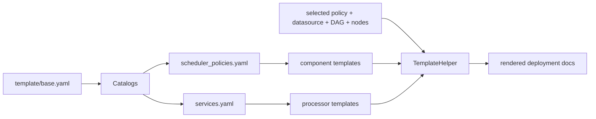

# Configuration Model

Dayu is configured through a combination of catalog files, component templates, datasource examples, visualization configs, and environment-variable-driven hook selection. This document explains how those pieces relate to each other.

## Configuration Surfaces

| Location | Role | Typical owner |
| --- | --- | --- |
| `template/base.yaml` | Global catalogs and cluster-wide defaults | platform maintainers |
| `template/scheduler_policies.yaml` | Install-time scheduler policy catalog | platform maintainers |
| `template/services.yaml` | Processor service catalog shown to DAG builders and deployment logic | platform maintainers |
| `template/{scheduler,generator,controller,distributor,monitor,processor}/*.yaml` | Component deployment templates and runtime env vars | platform maintainers |
| `config/datasource_configs/*.yaml` | User- or operator-selectable datasource examples | operators, demos, tests |
| `config/visualization_configs/*.yaml` | Example visualization configs for result pages | operators, demo maintainers |
| `template/result-visualizations.yaml` and `template/system-visualizations.yaml` | Default visualization configuration shipped by the platform | platform maintainers |
| `dependency/core/lib/algorithms/` plus env vars | Runtime hook implementation selection | runtime developers |

## Deployment Composition Pipeline

Backend install flow is data-driven rather than hard-coded.



At install time:

1. Backend reads `template/base.yaml`.
2. `scheduler_policies.yaml` maps a policy id to one scheduler template plus its dependent component templates.
3. `services.yaml` maps service ids to processor templates.
4. Frontend-selected datasource config, DAG workflow, and target nodes are injected into the template rendering step.
5. Backend emits deployment documents and installs them through the Kubernetes helper layer.

## Global Catalogs

### `template/base.yaml`

This file is the root of the platform catalog. It defines:

- namespace and image defaults
- log export and retention defaults
- datasource defaults
- scheduler policy catalog import
- service catalog import
- default result/system visualization config import

If you need to understand what the frontend is browsing or what the backend can install, start here.

### `template/scheduler_policies.yaml`

This file tells Dayu which templates belong together as one installable policy family.

Example:

| Policy id | Scheduler template | Dependent templates |
| --- | --- | --- |
| `fixed` | `template/scheduler/fixed-policy.yaml` | `generator-base.yaml`, `controller-base.yaml`, `distributor-base.yaml`, `monitor-base.yaml` |
| `casva` | `template/scheduler/casva.yaml` | `generator-casva.yaml`, `controller-for-evaluation.yaml`, `distributor-base.yaml`, `monitor-base.yaml` |
| `hei` | `template/scheduler/hei.yaml` | `generator-base.yaml`, `controller-for-evaluation.yaml`, `distributor-base.yaml`, `monitor-base.yaml` |

This is the main install-time switch between policy families.

### `template/services.yaml`

This file is the service catalog used by DAG construction and processor deployment. Each entry defines:

- a stable service id
- a display name and description
- input and output shape
- the processor template file used for deployment

The service catalog is what bridges user-facing DAG definitions and processor runtime templates.

## Component Templates

The `template/` subtree is split by component ownership.

| Directory | What it usually controls |
| --- | --- |
| `template/scheduler/` | scheduler hook family and agent parameters |
| `template/generator/` | source-side hook selection and scheduling request cadence |
| `template/controller/` | temp-file cleanup and display behavior |
| `template/distributor/` | distributor deployment placement and port |
| `template/monitor/` | monitor interval and enabled monitor hooks |
| `template/processor/` | processor type, model parameters, scenario extractors, queue strategy |

### Generator template pattern

Generator templates mainly choose hook families:

```yaml
- name: GEN_FILTER_NAME
  value: simple
- name: GEN_PROCESS_NAME
  value: simple
- name: GEN_COMPRESS_NAME
  value: simple
- name: GEN_BSO_NAME
  value: simple
```

### Scheduler template pattern

Scheduler templates mainly choose policy-specific hooks and parameters:

```yaml
- name: SCH_CONFIG_EXTRACTION_NAME
  value: hei
- name: SCH_AGENT_NAME
  value: hei
- name: SCH_AGENT_PARAMETERS
  value: "{'window_size': 8, 'mode': 'inference'}"
```

### Processor template pattern

Processor templates describe how one AI service runs:

```yaml
- name: PROCESSOR_NAME
  value: detector_tracker_processor
- name: SCENARIOS_EXTRACTORS
  value: "['obj_num', 'obj_size']"
- name: PRO_QUEUE_NAME
  value: simple
```

That is why adding a new service usually requires updating both `template/services.yaml` and a matching file under `template/processor/`.

## Runtime Env Naming Conventions

The hook system uses a consistent env-driven naming model.

| Pattern | Meaning |
| --- | --- |
| `<TYPE>_NAME` | alias registered through `ClassFactory` |
| `<TYPE>_PARAMETERS` | constructor parameters for the selected alias |
| list-valued env vars such as `SCENARIOS_EXTRACTORS` or `MONITORS` | ordered list of aliases to resolve repeatedly |
| visualization `hook_name` and `hook_params` | per-entry visualizer selection in YAML rather than env vars |

Common families:

| Family | Examples |
| --- | --- |
| Generator lifecycle | `GEN_BSO_NAME`, `GEN_ASO_NAME`, `GEN_BSTO_NAME` |
| Generator data path | `GEN_FILTER_NAME`, `GEN_PROCESS_NAME`, `GEN_COMPRESS_NAME`, `GEN_GETTER_NAME`, `GEN_GETTER_FILTER_NAME` |
| Scheduler | `SCH_CONFIG_EXTRACTION_NAME`, `SCH_AGENT_NAME`, `SCH_SELECTION_POLICY_NAME` |
| Processor | `PROCESSOR_NAME`, `PRO_QUEUE_NAME`, `SCENARIOS_EXTRACTORS` |
| Monitor | `MONITORS` |

For the full hook catalog, see [`../hooks/catalog.md`](../hooks/catalog.md).

## Datasource Configs And Manifests

Datasource configuration happens at two levels:

| Level | File examples | Purpose |
| --- | --- | --- |
| Backend-facing datasource config | `config/datasource_configs/*.yaml` | Defines datasource label, source type, source mode, and source list shown to backend/frontend |
| Source-runtime manifest | `<dataset>/http_video/manifest.json`, `<dataset>/rtsp_video/manifest.json` | Defines clip order, frame counts, and frame-index continuity for runtime playback |

The backend-facing YAML says which logical sources exist. The manifest says how a concrete dataset is played.

See [`../datasource/README.md`](../datasource/README.md) for the exact manifest contract.

## Visualization Configuration

Dayu separates runtime results from how they are rendered:

| Config file | Scope |
| --- | --- |
| `template/result-visualizations.yaml` | default task/result visualization set |
| `template/system-visualizations.yaml` | default system visualization set |
| `config/visualization_configs/*.yaml` | example custom configs that can be uploaded per source |

Each visualization entry describes:

- display metadata such as `name`, `type`, and `size`
- variables or axes
- the `hook_name` that produces the data
- optional `hook_params`

## Change Checklist

When changing configuration surfaces, mature repositories keep the data model, code, and docs aligned. For Dayu, use this checklist:

1. If you add a new policy family, update `template/scheduler_policies.yaml`, the scheduler template, and any required dependency templates.
2. If you add a new processor service, update `template/services.yaml`, add a processor template, and make sure the application code exists under `dependency/core/applications/`.
3. If you add a new hook alias, update templates or visualization configs that should expose it and document it in [`../hooks/catalog.md`](../hooks/catalog.md).
4. If you change datasource config shape or manifest semantics, update both backend-facing examples and [`../datasource/README.md`](../datasource/README.md).
5. If you change a backend-facing contract, update the API docs in [`../api/`](../api/README.md).
