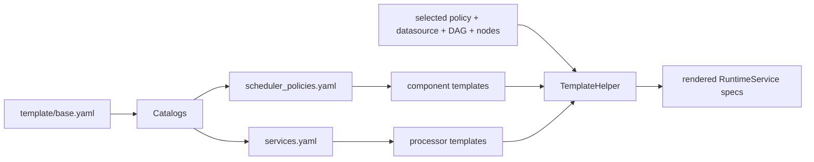

# Configuration Model

Dayu is configured through a combination of catalog files, component templates, datasource examples, visualization configs, and environment-variable-driven hook selection. This document explains how those pieces relate to each other.

## Configuration Surfaces

| Location | Role | Typical owner |
| --- | --- | --- |
| `template/base.yaml` | Global catalogs and cluster-wide defaults | platform maintainers |
| `template/scheduler_policies.yaml` | Install-time scheduler policy catalog | platform maintainers |
| `template/services.yaml` | Processor service catalog shown to DAG builders and deployment logic | platform maintainers |
| `template/{scheduler,generator,controller,distributor,monitor,processor}/*.yaml` | Component deployment templates and runtime env vars | platform maintainers |
| `config/datasource_configs/*.yaml` | User- or operator-selectable datasource examples | operators, demos, tests |
| `config/visualization_configs/*.yaml` | Example visualization configs for result pages | operators, demo maintainers |
| `config/service_yamls/example.yaml` | Illustrative renderer output for review, not an install input or lifecycle record | maintainers |
| `template/result-visualizations.yaml` and `template/system-visualizations.yaml` | Default visualization configuration shipped by the platform | platform maintainers |
| `dependency/core/lib/algorithms/` plus env vars | Runtime hook implementation selection | runtime developers |

## Deployment Composition Pipeline

Backend install flow is data-driven rather than hard-coded.


```mermaid
flowchart LR
    BASE["template/base.yaml"] --> CAT["Catalogs"]
    CAT --> POL["scheduler_policies.yaml"]
    CAT --> SVC["services.yaml"]
    POL --> COMP["component templates"]
    SVC --> PROC["processor templates"]
    USER["selected policy + datasource + DAG + nodes"] --> HELPER["TemplateHelper"]
    COMP --> HELPER
    PROC --> HELPER
    HELPER --> MANIFEST["rendered RuntimeService specs"]
```

At install time:

1. Backend reads `template/base.yaml`.
2. `scheduler_policies.yaml` maps a policy id to one scheduler template plus its dependent component templates.
3. `services.yaml` maps service ids to processor templates.
4. Frontend-selected datasource config, DAG workflow, and target nodes are injected into the template rendering step.
5. Backend compiles immutable RuntimeService specs, submits them through its single control-plane client, and publishes exact endpoints through the Scheduler RuntimeDirectory only after activation.

Application templates are logical inputs, not Kubernetes documents. `TemplateHelper` normalizes catalogs and source
deployment, and `RuntimeServiceRenderer` deterministically renders fixed `sedna.io/v1alpha1` `RuntimeService` objects.
Neither helper loads cluster configuration. All Kubernetes calls are owned by backend orchestration.

[`config/service_yamls/example.yaml`](../../config/service_yamls/example.yaml) shows the resulting RuntimeService shape,
including a routable processor and an endpointless generator. Do not apply or edit that file as an install mechanism:
backend generates real names, install ids, revisions, images, bootstrap, and target nodes transactionally.

### RuntimeDirectory task leases

Runtime workers never query Kubernetes. The backend injects the scheduler
endpoint and `lease_ttl_seconds` into `DAYU_RUNTIME_BOOTSTRAP`; the optional
`DAYU_RUNTIME_LEASE_TTL_SECONDS` environment variable provides the same TTL
when constructing a runtime context outside the normal renderer.

Each task is pinned to the immutable pair
`(runtime_directory_revision, root_uuid)`. The Generator must acquire that
lease before its first submission, Controllers renew it whenever they receive
or advance the task, and Processors maintain a renewal heartbeat throughout execution.
After the Distributor has durably stored the result and the Scheduler has
acknowledged its scenario update, it releases the lease. Any acquire or renew
outcome that is not explicitly acknowledged stops task progress. A failed
release is only logged and leaves the lease to expire naturally, which keeps
the corresponding RuntimeServices protected during drain.

## Global Catalogs

### `template/base.yaml`

This file is the root of the platform catalog. It defines:

- namespace and image defaults
- the backend-only service account and minimal cluster RBAC names
- the support-layer `JointMultiEdgeService` API version and kind
- RuntimeService activation, operation, drain, and task-lease deadlines
- file mount defaults
- log export and retention defaults
- datasource defaults
- default cloud-side processor backup behavior
- scheduler policy catalog import
- service catalog import
- default result/system visualization config import

If you need to understand what the frontend is browsing or what the backend can install, start here.

Control-plane fields:

| Field | Default | Meaning |
| --- | --- | --- |
| `backend-rbac.service-account` | `dayu-backend` | The only Dayu ServiceAccount allowed to call Kubernetes. |
| `backend-rbac.role` | `dayu-backend-runtime-manager` | Namespace-local RuntimeService, session, and metrics permissions. |
| `backend-rbac.role-binding` | `dayu-backend-runtime-manager-binding` | Namespace-local binding for the backend ServiceAccount. |
| `backend-rbac.cluster-role` | `dayu-backend-cluster-observer` | Base name for read-only Node and managed-agent Pod inventory. `dayu.sh` appends the namespace. |
| `backend-rbac.cluster-role-binding` | `dayu-backend-cluster-observer-binding` | Base name for the namespace-specific cluster observer binding. |
| `support-crd-meta.api-version` | `sedna.io/v1alpha1` | API used only to create support-layer resources. |
| `support-crd-meta.kind` | `JointMultiEdgeService` | Kind used only for backend/frontend/Redis/datasource bootstrap. |

Runtime control fields:

| Field | Default (seconds) | Meaning |
| --- | ---: | --- |
| `runtime.activation-timeout-seconds` | `300` | Maximum wait for exact Sedna `Activated` and dynamic `Ready` conditions. |
| `runtime.operation-timeout-seconds` | `900` | Backend-to-scheduler decision/publication request budget. |
| `runtime.inventory-ttl-seconds` | `30` | Backend-owned node snapshot TTL; callers cannot force refresh it. |
| `runtime.drain-timeout-seconds` | `3900` | Maximum retirement wait; must exceed lease TTL plus the quiet window so failed releases can expire safely. |
| `runtime.drain-quiet-window-seconds` | `10` | Required continuous zero-lease interval before deletion. |
| `runtime.lease-ttl-seconds` | `3600` | Lease TTL injected into runtime bootstrap. |

There are intentionally no runtime Kubernetes endpoint, selector, cache TTL, warm-up, or refresh settings. Such a
setting would reintroduce cluster discovery into application processes and violates the architecture; the renderer
rejects templates that attempt to define one instead of silently stripping or accepting it.

### Support Redis durability

`dayu.sh` mounts Redis `/data` from
`<default-file-mount-prefix>/runtime-state/<namespace>/redis` on the cloud node and starts Redis with
`--appendonly yes --appendfsync always --dir /data`. This persists Scheduler's active RuntimeDirectory, expiring
proposals, and task leases across Scheduler/Redis Pod replacement. The path is namespace-scoped but node-local: keep it
writable and durable, and explicitly migrate it if the support Redis moves to another cloud node.

Normal uninstall uses Scheduler's install-scoped proposal index to atomically delete the active directory key, every
pending proposal, and the index itself only after lease drain. Task-lease key expiry bounds the remaining transient
state. Forced shell cleanup does not provide that transactional guarantee and does not erase the host directory.

### `template/scheduler_policies.yaml`

This file tells Dayu which templates belong together as one installable policy family.

The current policy catalog is larger than the three examples below. Treat this table as a shape example, then inspect
`template/scheduler_policies.yaml` for the exact current installable ids.

| Policy id | Scheduler template | Dependent templates |
| --- | --- | --- |
| `fixed` | `template/scheduler/fixed-policy.yaml` | `generator-base.yaml`, `controller-base.yaml`, `distributor-base.yaml`, `monitor-base.yaml` |
| `casva` | `template/scheduler/casva.yaml` | `generator-casva.yaml`, `controller-for-evaluation.yaml`, `distributor-base.yaml`, `monitor-base.yaml` |
| `hei` | `template/scheduler/hei.yaml` | `generator-base.yaml`, `controller-for-evaluation.yaml`, `distributor-base.yaml`, `monitor-base.yaml` |

This is the main install-time switch between policy families.

Current catalog families include:

| Family | Policy ids |
| --- | --- |
| Static and simple baselines | `fixed`, `cloud-only-policy`, `edge-only-policy`, `dynamic-policy`, `fc` |
| Video/configuration research baselines | `steady`, `madeye`, `adamec`, `gecko`, `casva`, `cevas`, `chameleon`, `crave`, `model-switch`, `deepva`, `offline-profiling`, `online-profiling` |
| Hierarchical embodied intelligence | `hei`, `hei-macro-only`, `hei-micro-only`, `hei-synchronous` |
| Hedger and ablations | `hedger`, `hedger-offloading-benchmark`, `hedger-deployment-benchmark`, `hedger-no-graph-encoder`, `hedger-flat`, `hedger-deployment-only`, `hedger-offloading-only` |

Entries use a `dependency:` map for generator/controller/distributor/monitor templates. Keep this shape canonical when
adding or reviewing policy definitions.

### `template/services.yaml`

This file is the service catalog used by DAG construction and processor deployment. Each entry defines:

- a stable service id
- a display name and description
- `input` and `output` type labels as YAML lists, even when there is only one label
- the processor template file used for deployment

The service catalog is what bridges user-facing DAG definitions and processor runtime templates.
Scalar `input` or `output` values such as `input: frame` are invalid; DAG validation only accepts list-form
contracts such as `input: [frame]`.
These labels describe payload form rather than business meaning. Prefer generic labels such as `frame`, `bbox`,
`text`, `segmentation`, `track`, `attribute`, `trajectory`, `pose`, or `graph`; avoid labels that encode a specific
application or scene meaning. This keeps DAG composition permissive: the platform checks shape compatibility and leaves
semantic correctness to the user.

For the structured traffic services and a reviewable example DAG, see
[`structured-traffic-services.md`](structured-traffic-services.md).

### Application DAG Files

The DAG orchestration UI can import and export `.dag` files. A `.dag` file is JSON content with this top-level shape:

```json
{
  "format": "dayu.application-dag",
  "version": 1,
  "dag_name": "traffic risk monitoring",
  "dag": {
    "_start": ["traffic-detection"],
    "traffic-detection": {
      "id": "traffic-detection",
      "prev": [],
      "succ": [],
      "service_id": "traffic-detection"
    }
  },
  "layout": {
    "direction": "LR",
    "nodes": {
      "traffic-detection": { "x": 0, "y": 120 }
    }
  }
}
```

`dag` is the backend-facing logical workflow. `layout` is optional and is used only by the frontend canvas to restore
node positions. The current orchestration UI and backend validation use service ids as node ids, so each node key,
`id`, and `service_id` should match. The repository includes a reviewable example at
`config/application_dags/driving_risk_perception.dag`.

## Component Templates

The `template/` subtree is split by component ownership.

| Directory | What it usually controls |
| --- | --- |
| `template/scheduler/` | scheduler hook family and agent parameters |
| `template/generator/` | source-side hook selection and scheduling request cadence |
| `template/controller/` | temp-file cleanup and display behavior |
| `template/distributor/` | distributor deployment placement and port |
| `template/monitor/` | monitor interval and enabled monitor hooks |
| `template/processor/` | processor type, model parameters, scenario extractors, queue strategy |

### Generator template pattern

Generator templates mainly choose hook families:

```yaml
- name: GEN_FILTER_NAME
  value: simple
- name: GEN_PROCESS_NAME
  value: simple
- name: GEN_COMPRESS_NAME
  value: simple
- name: GEN_BSO_NAME
  value: simple
```

### Scheduler template pattern

Scheduler templates mainly choose policy-specific hooks and parameters:

```yaml
- name: SCH_CONFIG_EXTRACTION_NAME
  value: hei
- name: SCH_AGENT_NAME
  value: hei
- name: SCH_AGENT_PARAMETERS
  value: "{'window_size': 8, 'mode': 'inference'}"
```

### Processor template pattern

Processor templates describe how one AI service runs:

```yaml
- name: PROCESSOR_NAME
  value: detector_tracker_processor
- name: SCENARIOS_EXTRACTORS
  value: "['obj_num', 'obj_size']"
- name: PRO_QUEUE_NAME
  value: simple
```

That is why adding a new service usually requires updating both `template/services.yaml` and a matching file under `template/processor/`.
Application code should remain service-local under `dependency/core/applications/<service>/`; DAG membership is decided by
the user-selected workflow at runtime, not by hard-coded schema names inside the service implementation.

## Processor Deployment Controls

Processor RuntimeServices are generated from the validated scheduler placement plus any Backend-configured cloud
backup. For each desired slot, backend compares the stable rollout hash with the active unit; a placement, image,
template, mount, or effective environment change creates a new immutable RuntimeService revision.

Every initial-deployment and redeployment policy is normalized through
`dependency/core/lib/scheduling/deployment_plan.py`. The accepted shape is exactly
`logical service -> non-empty JSON node list`, covering every current-DAG service and only candidate nodes.

`template/base.yaml` controls whether Backend composes a default cloud replica after that validation:

| Field | Default | Meaning |
| --- | --- | --- |
| `default-cloud-processor-backup` | `false` | `true` adds the exact Backend-resolved cloud node to every logical service placement; `false` uses the validated Scheduler plan unchanged. |

This option applies identically to initial deployment and redeployment. It is an additive replica policy, not a repair
path: Scheduler must still return every current-DAG service with at least one valid target, and unknown services,
missing services, empty lists, or invalid nodes still fail before Backend adds the cloud node. If Scheduler already
selected the exact cloud hostname, set normalization prevents a duplicate RuntimeService. Setting the option to
`false` does not forbid cloud placement; an exact cloud hostname returned by Scheduler remains legal. The built-in
`cloud-only-policy` continues to select `system.cloud_device` explicitly. Despite the option's historical “backup”
name, the cloud RuntimeService is activated and published as a normal routable replica rather than a dormant standby.

## Runtime Pod Security Boundary

The renderer always sets `automountServiceAccountToken: false`, omits `serviceAccountName`, and renders mounts as native
Pod `volumes`/`volumeMounts`. It rejects a logical template that contains Kubernetes discovery/cache env variables.
Do not add projected service-account-token volumes or Kubernetes clients to runtime images. Cluster inspection,
RuntimeService watches, metrics joins, and session persistence belong in backend only.

## Runtime Env Naming Conventions

The hook system uses a consistent env-driven naming model.

| Pattern | Meaning |
| --- | --- |
| `<TYPE>_NAME` | alias registered through `ClassFactory` |
| `<TYPE>_PARAMETERS` | constructor parameters for the selected alias |
| list-valued env vars such as `SCENARIOS_EXTRACTORS` or `MONITORS` | ordered list of aliases to resolve repeatedly |
| visualization `hook_name` and `hook_params` | per-entry visualizer selection in YAML rather than env vars |

Common families:

| Family | Examples |
| --- | --- |
| Generator lifecycle | `GEN_BSO_NAME`, `GEN_ASO_NAME`, `GEN_BSTO_NAME` |
| Generator data path | `GEN_FILTER_NAME`, `GEN_PROCESS_NAME`, `GEN_COMPRESS_NAME`, `GEN_GETTER_NAME`, `GEN_GETTER_FILTER_NAME` |
| Scheduler | `SCH_CONFIG_EXTRACTION_NAME`, `SCH_AGENT_NAME`, `SCH_SELECTION_POLICY_NAME` |
| Processor | `PROCESSOR_NAME`, `STRUCTURED_PROCESSOR_PARAMETERS`, `PRO_QUEUE_NAME`, `SCENARIOS_EXTRACTORS` |
| Monitor | `MONITORS` |

For the full hook catalog, see [`../hooks/catalog.md`](../hooks/catalog.md).

## Datasource Configs And Manifests

Datasource configuration happens at two levels:

| Level | File examples | Purpose |
| --- | --- | --- |
| Backend-facing datasource config | `config/datasource_configs/*.yaml` | Defines datasource label, source type, source mode, and source list shown to backend/frontend |
| Source-runtime manifest | `<dataset>/http_video/manifest.json`, `<dataset>/rtsp_video/manifest.json` | Defines clip order, frame counts, and frame-index continuity for runtime playback |

The backend-facing YAML says which logical sources exist. The manifest says how a concrete dataset is played.
Repository datasource examples currently cover simulated `http_video`, simulated `rtsp_video`, and real-camera
`v4l2_video` source modes. `v4l2_video` is selected by generator hook configuration and does not use the
`http_video`/`rtsp_video` manifest layout.

See [`../datasource/README.md`](../datasource/README.md) for the exact manifest contract.

## Visualization Configuration

Dayu separates runtime results from how they are rendered:

| Config file | Scope |
| --- | --- |
| `template/result-visualizations.yaml` | default task/result visualization set |
| `template/system-visualizations.yaml` | default system visualization set |
| `config/visualization_configs/*.yaml` | example custom configs that can be uploaded per source |

Each visualization entry describes:

- display metadata such as `name`, `type`, and `size`
- variables or axes
- the `hook_name` that produces the data
- optional `hook_params`

## Change Checklist

When changing configuration surfaces, mature repositories keep the data model, code, and docs aligned. For Dayu, use this checklist:

1. If you add a new policy family, update `template/scheduler_policies.yaml`, the scheduler template, and any required dependency templates.
2. If you add a new processor service, update `template/services.yaml`, add a processor template, and make sure the application code exists under `dependency/core/applications/`.
3. If you add a new hook alias, update templates or visualization configs that should expose it and document it in [`../hooks/catalog.md`](../hooks/catalog.md).
4. If you change datasource config shape or manifest semantics, update both backend-facing examples and [`../datasource/README.md`](../datasource/README.md).
5. If you change a backend-facing contract, update the API docs in [`../api/`](../api/README.md).
6. If you change install, uninstall, redeployment, or cleanup behavior, update [`../operations/README.md`](../operations/README.md).
