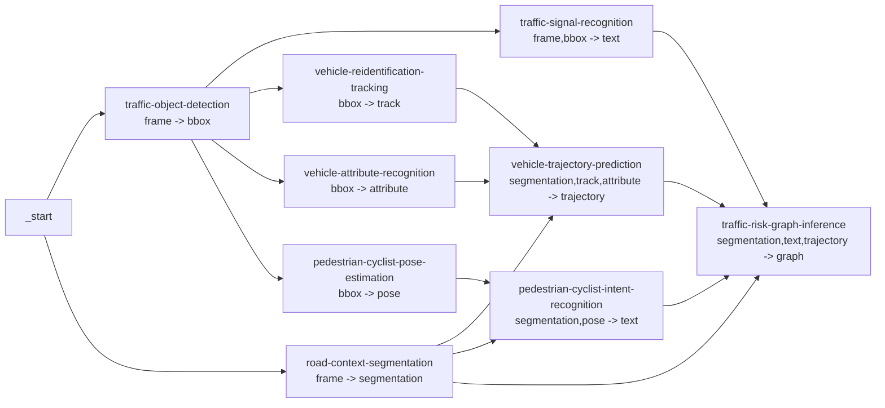

# Structured Traffic Services

This document describes the structured traffic services added for composing richer DAG applications.
They are ordinary processor services and are not tied to a hard-coded DAG family. Users compose them at runtime through
the workflow definition.

## Design Rules

- Service catalog `input` and `output` labels describe payload form, not business meaning.
- Use generic form labels such as `frame`, `bbox`, `text`, `segmentation`, `track`, `attribute`, `trajectory`, `pose`,
  and `graph`.
- Processor templates keep `INPUT_SERVICES: []` for these services. With an empty list, `structured_processor` reads the
  current DAG node's real predecessor services at runtime, which keeps user-defined DAG composition flexible.
- Each application lives in its own `dependency/core/applications/<service>/` folder and exports `Application` through
  that folder's `__init__.py`.
- Service outputs may use business-specific field names inside the result dictionary. Those fields are runtime content,
  not DAG compatibility labels.

## Runtime Contract

All services below use `PROCESSOR_NAME=structured_processor`.

The processor calls each application with:

```python
{
    "task": {...},
    "frames": [...],
    "inputs": {
        "<previous-service-name>": {
            "service": "...",
            "outputs": {...},
            "profile": {...}
        }
    }
}
```

Each application returns:

```python
{
    "service": "<service-name>",
    "outputs": {...},
    "profile": {
        "num_objects": 0,
        "input_bytes": 0,
        "output_bytes": 0,
        "frame_count": 0,
        "model_name": "...",
        "model_variant": "...",
        "model_weight": "...",
        "synthetic_complexity": 1
    }
}
```

`structured_profile` stores the returned `profile` as scenario data for scheduler and debugging consumers.

## Service Catalog

| Service id | Form input | Form output | Model variant | Main output fields | Application path |
| --- | --- | --- | --- | --- | --- |
| `traffic-object-detection` | `[frame]` | `[bbox]` | `yolov8s` | `detections`, `object_counts` | `dependency/core/applications/traffic_object_detection/` |
| `road-context-segmentation` | `[frame]` | `[segmentation]` | `yolop` | `lane_polylines`, `drivable_area`, `crosswalk_regions`, `road_boundary` | `dependency/core/applications/road_context_segmentation/` |
| `traffic-signal-recognition` | `[frame, bbox]` | `[text]` | `mobilenetv3` | `signals` | `dependency/core/applications/traffic_signal_recognition/` |
| `vehicle-reidentification-tracking` | `[bbox]` | `[track]` | `bytetrack-reidentification` | `vehicle_tracklets` | `dependency/core/applications/vehicle_reidentification_tracking/` |
| `vehicle-attribute-recognition` | `[bbox]` | `[attribute]` | `efficientnet` | `vehicle_attributes` | `dependency/core/applications/vehicle_attribute_recognition/` |
| `vehicle-trajectory-prediction` | `[segmentation, track, attribute]` | `[trajectory]` | `trajectory-transformer` | `trajectory_predictions` | `dependency/core/applications/vehicle_trajectory_prediction/` |
| `pedestrian-cyclist-pose-estimation` | `[bbox]` | `[pose]` | `rtmpose` | `skeletons` | `dependency/core/applications/pedestrian_cyclist_pose_estimation/` |
| `pedestrian-cyclist-intent-recognition` | `[segmentation, pose]` | `[text]` | `st-gcn` | `pedestrian_cyclist_intents` | `dependency/core/applications/pedestrian_cyclist_intent_recognition/` |
| `traffic-risk-graph-inference` | `[segmentation, text, trajectory]` | `[graph]` | `graph-transformer` | `events`, `graph_summary` | `dependency/core/applications/traffic_risk_graph_inference/` |

Model parameter staging is recorded in `.model/dag1_model_parameters.yaml`.

## Recommended Review DAG

The repository includes this example as `config/application_dags/traffic_risk_monitoring.dag`.



The DAG is intentionally application-oriented:

- `traffic-object-detection` and `road-context-segmentation` start from frames in parallel.
- Detection feeds services that need bounding boxes: signal recognition, vehicle tracking, vehicle attributes, and
  pedestrian or cyclist pose.
- Road context joins tracking and attributes for trajectory prediction.
- Road context joins pose for pedestrian or cyclist intent recognition.
- Risk graph inference joins segmentation, signal text, trajectory, and intent text into graph-shaped event output.

This is only a recommended application workflow. Because `input` and `output` labels are generic forms, users can still
build other shape-compatible DAGs, including semantically odd combinations, when that helps experimentation.
