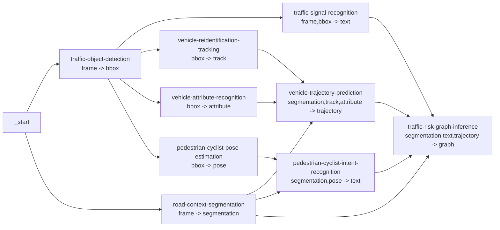

# Structured Traffic Services

This document describes the structured traffic services added for composing richer DAG applications.
They are ordinary processor services and are not tied to a hard-coded DAG family. Users compose them at runtime through
the workflow definition.

## Design Rules

- Service catalog `input` and `output` labels describe payload form, not business meaning.
- Use generic form labels such as `frame`, `bbox`, `text`, `segmentation`, `track`, `attribute`, `trajectory`, `pose`,
  and `graph`.
- Processor templates keep `INPUT_SERVICES: []` for these services. With an empty list, `structured_processor` reads the
  current DAG node's real predecessor services at runtime, which keeps user-defined DAG composition flexible.
- Each application lives in its own `dependency/core/applications/<service>/` folder and exports `Application` through
  that folder's `__init__.py`.
- Service outputs may use business-specific field names inside the result dictionary. Those fields are runtime content,
  not DAG compatibility labels.

## Runtime Contract

All services below use `PROCESSOR_NAME=structured_processor`.

The processor calls each application with:

```python
{
    "task": {...},
    "frames": [...],
    "inputs": {
        "<previous-service-name>": {
            "service": "...",
            "outputs": {...},
            "profile": {...}
        }
    }
}
```

Each application returns:

```python
{
    "service": "<service-name>",
    "outputs": {...},
    "profile": {
        "num_objects": 0,
        "input_bytes": 0,
        "output_bytes": 0,
        "frame_count": 0,
        "model_name": "...",
        "model_weight": "...",
        "model_weight_exists": true,
        "model_loaded": true,
        "inference_backend": "...",
        "model_error": ""
    }
}
```

`structured_profile` stores the returned `profile` as scenario data for scheduler and debugging consumers.
Each application follows the same wrapper pattern as the existing detector/classifier services: the top-level service
accepts `trt_weights`, `trt_plugin_library`, `non_trt_weights`, and `device`, then selects
`*_with_tensorrt` or `*_without_tensorrt` according to `USE_TENSORRT`. TensorRT classes are present as explicit stubs and
raise `NotImplementedError` until engine implementations are added.
`model_loaded` means the service reconstructed a runnable neural model object. Some services also report
`checkpoint_loaded` when a staged checkpoint was readable but the deployable path uses a non-neural adapter because the
upstream project requires extra model definitions or config files that are not carried by the checkpoint alone.

## Service Catalog

| Service id | Form input | Form output | Non-TRT backend | Main output fields |
| --- | --- | --- | --- | --- |
| `traffic-object-detection` | `[frame]` | `[bbox]` | Ultralytics YOLO detection, with COCO traffic-class mapping | `detections`, `object_counts` |
| `road-context-segmentation` | `[frame]` | `[segmentation]` | OpenCV lane/drivable/crosswalk adapter; YOLOP checkpoint is staged and checksumable | `lane_polylines`, `drivable_area`, `crosswalk_regions`, `road_boundary` |
| `traffic-signal-recognition` | `[frame, bbox]` | `[text]` | Ultralytics YOLO traffic-light state detection | `signals` |
| `vehicle-reidentification-tracking` | `[bbox]` | `[track]` | IoU plus crop-histogram tracking adapter; FastReID checkpoint is staged and checksumable | `vehicle_tracklets` |
| `vehicle-attribute-recognition` | `[bbox]` | `[attribute]` | EfficientNet-B0 checkpoint trained for vehicle type classification | `vehicle_attributes` |
| `vehicle-trajectory-prediction` | `[segmentation, track, attribute]` | `[trajectory]` | PIE-trained sequence GRU over normalized bbox history | `trajectory_predictions` |
| `pedestrian-cyclist-pose-estimation` | `[bbox]` | `[pose]` | Optional MMPose RTMPose if `non_trt_config` is provided; geometric pose adapter otherwise | `skeletons` |
| `pedestrian-cyclist-intent-recognition` | `[segmentation, pose]` | `[text]` | PIE-trained sequence GRU over bbox, motion, action, and look features | `pedestrian_cyclist_intents` |
| `traffic-risk-graph-inference` | `[segmentation, text, trajectory]` | `[graph]` | DoTA-trained risk MLP over graph-derived tabular features | `events`, `graph_summary` |

Model parameter staging is recorded in `.model/dag1_model_parameters.yaml`.

## Recommended Review DAG

The repository includes this example as `config/application_dags/traffic_risk_monitoring.dag`.



The DAG is intentionally application-oriented:

- `traffic-object-detection` and `road-context-segmentation` start from frames in parallel.
- Detection feeds services that need bounding boxes: signal recognition, vehicle tracking, vehicle attributes, and
  pedestrian or cyclist pose.
- Road context joins tracking and attributes for trajectory prediction.
- Road context joins pose for pedestrian or cyclist intent recognition.
- Risk graph inference joins segmentation, signal text, trajectory, and intent text into graph-shaped event output.

This is only a recommended application workflow. Because `input` and `output` labels are generic forms, users can still
build other shape-compatible DAGs, including semantically odd combinations, when that helps experimentation.
