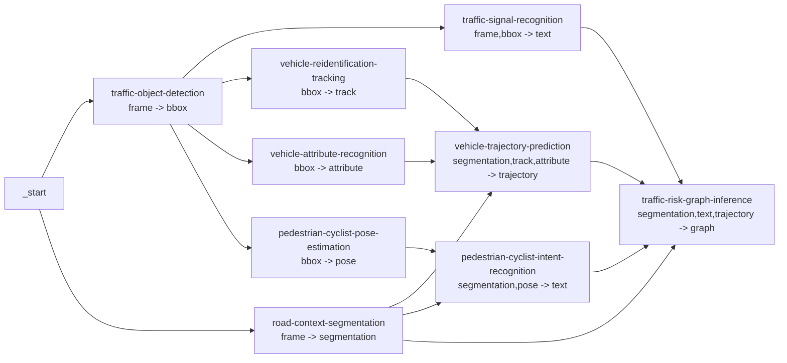

# Structured Traffic Services

This document describes the structured traffic services added for composing richer DAG applications.
They are ordinary processor services and are not tied to a hard-coded DAG family. Users compose them at runtime through
the workflow definition.

## Design Rules

- Service catalog `input` and `output` labels describe payload form, not business meaning.
- Use generic form labels such as `frame`, `bbox`, `text`, `segmentation`, `track`, `attribute`, `trajectory`, `pose`,
  and `graph`.
- `structured_processor` reads the current DAG node's real predecessor services at runtime, so input collection follows
  the DAG the user submits instead of a service-local override parameter.
- Each service implementation lives in its own `dependency/core/applications/<service>/` folder and exports `Structured_Processor` through
  that folder's `__init__.py`.
- Service outputs use the same record shape for every label: each label maps to a list of records, and each record has
  `frame_index` plus an `items` list. Business-specific details belong inside each item.

## Runtime Contract

All services below use `PROCESSOR_NAME=structured_processor`.

The processor calls each `Structured_Processor` with:

```python
{
    "task": {...},
    "frames": [...],
    "inputs": {
        "<previous-service-name>": {
            "service": "...",
            "outputs": {...},
            "profile": {...}
        }
    }
}
```

Each `Structured_Processor` returns only service-specific outputs:

```python
{
    "<form-label>": [
        {
            "frame_index": 0,
            "items": [...]
        }
    ]
}
```

`structured_processor` wraps those outputs into the task content envelope:

```python
{
    "service": "<service-name>",
    "outputs": {...},
    "profile": {
        "frame_count": 0
    }
}
```

`structured_profile` stores the processor-created `profile` as scenario data for scheduler and debugging consumers.
Each service implementation follows the same wrapper pattern as the existing detector/classifier services: the top-level
`Structured_Processor` accepts `trt_weights`, `trt_plugin_library`, `non_trt_weights`, and `device`, then selects
`*_with_tensorrt` or `*_without_tensorrt` according to `USE_TENSORRT`. TensorRT classes are present as explicit stubs and
raise `NotImplementedError` until engine implementations are added.
Model/backend status belongs to service logs, health checks, or model manifests instead of per-task profile content.

## Service Catalog

| Service id | Form input | Form output | Non-TRT backend | Output content |
| --- | --- | --- | --- | --- |
| `traffic-object-detection` | `[frame]` | `[bbox]` | Ultralytics YOLO detection, with COCO traffic-class mapping | `bbox` records with item-level boxes, labels, scores, and object ids |
| `road-context-segmentation` | `[frame]` | `[segmentation]` | OpenCV lane/drivable/crosswalk adapter; YOLOP checkpoint is staged and checksumable | `segmentation` records with item-level polygons or polylines |
| `traffic-signal-recognition` | `[frame, bbox]` | `[text]` | Ultralytics YOLO traffic-light state detection | `text` records with item-level signal state text and source boxes |
| `vehicle-reidentification-tracking` | `[bbox]` | `[track]` | IoU plus crop-histogram tracking adapter; FastReID checkpoint is staged and checksumable | `track` records with item-level track ids and history |
| `vehicle-attribute-recognition` | `[bbox]` | `[attribute]` | EfficientNet-B0 checkpoint trained for vehicle type classification | `attribute` records with item-level vehicle attributes |
| `vehicle-trajectory-prediction` | `[segmentation, track, attribute]` | `[trajectory]` | PIE-trained sequence GRU over normalized bbox history | `trajectory` records with item-level future points and risk hints |
| `pedestrian-cyclist-pose-estimation` | `[bbox]` | `[pose]` | Optional MMPose RTMPose if `non_trt_config` is provided; geometric pose adapter otherwise | `pose` records with item-level keypoints and source boxes |
| `pedestrian-cyclist-intent-recognition` | `[segmentation, pose]` | `[text]` | PIE-trained sequence GRU over bbox, motion, action, and look features | `text` records with item-level intent text and confidence |
| `traffic-risk-graph-inference` | `[segmentation, text, trajectory]` | `[graph]` | DoTA-trained risk MLP over graph-derived tabular features | `graph` records with item-level nodes, edges, events, and summary |

Model parameter staging is recorded in `.model/dag1_model_parameters.yaml`.

## Service Result Visualization

The repository includes per-service frame overlay hooks for checking whether a DAG service produced reasonable results.
These hooks are categorized by drawing method instead of by service name:

| Hook | Main output shape | Typical services |
| --- | --- | --- |
| `bbox_frame` | items with `bbox` plus labels or scores | object detection, signal recognition, vehicle attributes |
| `segmentation_frame` | polygons and polylines | road context segmentation |
| `track_frame` | track histories with `bboxes` | vehicle reidentification and tracking |
| `trajectory_frame` | predicted future points | vehicle trajectory prediction |
| `pose_frame` | keypoints and optional boxes | pedestrian or cyclist pose estimation |
| `text_frame` | text records, optionally anchored to another service by key | pedestrian or cyclist intent recognition |
| `event_frame` | graph/event summaries | traffic risk graph inference |

`config/visualization_configs/driving_perception_visualization_config.yaml` includes one image visualization per service
in the recommended traffic DAG plus supporting DAG/runtime visualizations. The hooks only name the service/output to
inspect; they do not encode DAG membership. Users can upload or adapt the same config for any runtime DAG whose services
expose compatible structured outputs.

## Recommended Review DAG

The repository includes this example as `config/application_dags/traffic_risk_monitoring.dag`.



The DAG is intentionally application-oriented:

- `traffic-object-detection` and `road-context-segmentation` start from frames in parallel.
- Detection feeds services that need bounding boxes: signal recognition, vehicle tracking, vehicle attributes, and
  pedestrian or cyclist pose.
- Road context joins tracking and attributes for trajectory prediction.
- Road context joins pose for pedestrian or cyclist intent recognition.
- Risk graph inference joins segmentation, signal text, trajectory, and intent text into graph-shaped event output.

This is only a recommended application workflow. Because `input` and `output` labels are generic forms, users can still
build other shape-compatible DAGs, including semantically odd combinations, when that helps experimentation.
