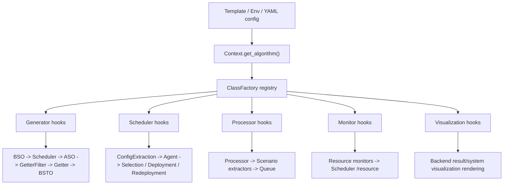

# Hook Function Docs

Dayu uses a registry-based hook mechanism to make data generation, scheduling, monitoring, processing, and visualization dynamically configurable. This is the core extension model of the runtime.

## Why Hooks Exist

The hook system allows the same runtime skeleton to support different scheduling policies and source-processing behaviors without forking the entire control flow.

Examples:

- Switching scheduler policy families by changing YAML templates and environment variables.
- Replacing frame filtering, processing, and compression logic without rewriting generator loops.
- Selecting different scenario extractors, queue behaviors, and visualizers per deployment.

## Core Building Blocks

| Part | Responsibility | Main code path |
| --- | --- | --- |
| `ClassFactory` | Registers implementations under a `ClassType` plus alias. | `dependency/core/lib/common/class_factory.py` |
| `Context.get_algorithm()` | Resolves hook name and parameters, then instantiates the registered class. | `dependency/core/lib/common/context.py` |
| `dependency/core/lib/algorithms/__init__.py` | Auto-imports algorithm packages so registrations happen at import time. | `dependency/core/lib/algorithms/__init__.py` |
| Templates and env vars | Choose which hook alias to use at runtime. | `template/` |

## How Resolution Works

### Single-hook resolution

Most hooks use this pattern:

- Environment variable `<TYPE>_NAME` selects the alias.
- Optional `<TYPE>_PARAMETERS` provides a dictionary of constructor parameters.
- `Context.get_algorithm("<TYPE>")` loads and instantiates the hook.

Example from generator templates:

```yaml
- name: GEN_FILTER_NAME
  value: simple
- name: GEN_COMPRESS_NAME
  value: simple
- name: GEN_BSO_NAME
  value: simple
```

### List-based resolution

Some subsystems load a list of hook aliases instead of a single alias:

| Config key | Consumer | Meaning |
| --- | --- | --- |
| `SCENARIOS_EXTRACTORS` | Processor | Ordered list of `PRO_SCENARIO` hooks |
| `MONITORS` | Monitor | Ordered list of `MON_PRAM` hooks |

### Visualization-driven resolution

Visualization hooks are selected per config entry, not by env variable:

```yaml
- name: CPU Usage
  type: curve
  variables: []
  hook_name: cpu_usage
```

Backend resolves `hook_name` and optional `hook_params` for every visualization item at runtime.

## Lifecycle Overview



## Runtime Call Chains

### Generator

`Generator` and `VideoGenerator` resolve hooks in this order:

| Hook type | Purpose |
| --- | --- |
| `GEN_BSO` | Build scheduler request parameters before calling scheduler |
| `GEN_ASO` | Apply scheduler response back into generator state |
| `GEN_GETTER` | Pull source data and create new tasks |
| `GEN_BSTO` | Enrich a task just before it is submitted to controller |
| `GEN_FILTER` | Keep or drop frames |
| `GEN_PROCESS` | Transform kept frames |
| `GEN_COMPRESS` | Persist a frame buffer to a file |
| `GEN_GETTER_FILTER` | Decide whether the generator should skip this round entirely |

### Scheduler

`Scheduler` resolves startup hooks once and then instantiates one `SCH_AGENT` per source:

| Hook type | Purpose |
| --- | --- |
| `SCH_CONFIG_EXTRACTION` | Load configuration spaces and policy-specific files |
| `SCH_SCENARIO_RETRIEVAL` | Convert a processed task into scheduler state |
| `SCH_POLICY_RETRIEVAL` | Recover the currently applied policy from a task |
| `SCH_STARTUP_POLICY` | Provide a fallback plan before an agent can decide |
| `SCH_AGENT` | Maintain policy-specific scheduling state per source |
| `SCH_SELECTION_POLICY` | Select the execution node for a source |
| `SCH_INITIAL_DEPLOYMENT_POLICY` | Compute deployment for first install |
| `SCH_REDEPLOYMENT_POLICY` | Compute deployment updates after install |

### Processor and monitor

| Hook type | Purpose |
| --- | --- |
| `PROCESSOR` | Main model-serving behavior for one service |
| `PRO_QUEUE` | Queue discipline inside processor server |
| `PRO_SCENARIO` | Derive scheduler features from inference results |
| `MON_PRAM` | Sample one resource metric and append it to the monitor payload |

### Visualization

| Hook type | Purpose |
| --- | --- |
| `RESULT_VISUALIZER` | Render task-level outputs such as frames, curves, or DAG topology |
| `SYSTEM_VISUALIZER` | Render system-level snapshots such as CPU, memory, and scheduler overhead |

## Extension Guide

### Add a new hook implementation

1. Choose the correct base interface under `dependency/core/lib/algorithms/**/base_*.py` or the processor module.
2. Implement the class with the expected call signature.
3. Register it with `@ClassFactory.register(ClassType.<TYPE>, alias="<name>")`.
4. Make sure the containing package is imported through the algorithm auto-loader or processor module import path.
5. Expose it through a template, env variable, or visualization YAML.
6. Update [`catalog.md`](./catalog.md) so the alias is documented.

### Document constructor parameters

- Use `<TYPE>_PARAMETERS` for env-driven hooks.
- Use `hook_params` for visualization hooks.
- Keep parameters serializable as YAML or stringified dictionaries because that is how current templates pass them around.

### Compatibility guidelines

- Keep hook signatures compatible with the caller, not just with the base class name.
- If a hook is experimental or tied to a research prototype, mark it clearly in docs and templates.
- If a hook changes the scheduler request or response shape, update both the producing and consuming docs.

## Known Special Cases

- `dependency/core/lib/algorithms/__init__.py` skips optional algorithm packages when a dependency is missing. A hook can exist in the repository but still be unavailable at runtime if its optional dependency is not installed.
- Some hooks are research-oriented and rely on offline assets or model files under mounted volumes.
- `obj_velocity` is registered as a scenario extractor alias but its implementation is currently a placeholder.

## Next Step

Use [`catalog.md`](./catalog.md) as the implementation index when you need a specific alias, constructor path, or hook family.
