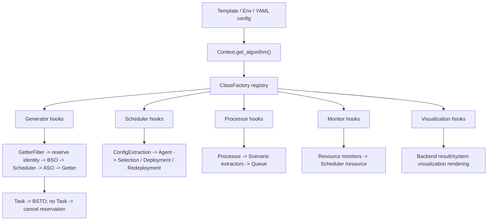

# Hook Function Docs

Dayu uses a registry-based hook mechanism to make data generation, scheduling, monitoring, processing, and visualization dynamically configurable. This is the core extension model of the runtime.

## Why Hooks Exist

The hook system allows the same runtime skeleton to support different scheduling policies and source-processing behaviors without forking the entire control flow.

Examples:

- Switching scheduler policy families by changing YAML templates and environment variables.
- Replacing frame filtering, processing, and compression logic without rewriting generator loops.
- Selecting different scenario extractors, queue behaviors, and visualizers per deployment.

## Core Building Blocks

| Part | Responsibility | Main code path |
| --- | --- | --- |
| `ClassFactory` | Registers implementations under a `ClassType` plus alias. | `dependency/core/lib/common/class_factory.py` |
| `Context.get_algorithm()` | Resolves hook name and parameters, then instantiates the registered class. | `dependency/core/lib/common/context.py` |
| `dependency/core/lib/algorithms/__init__.py` | Imports each hook-family package so discovery starts during core initialization. | `dependency/core/lib/algorithms/__init__.py` |
| Hook loader | Imports public single-file hooks and explicit package entry points. | `dependency/core/lib/algorithms/loader.py` |
| Templates and env vars | Choose which hook alias to use at runtime. | `template/` |

## Discovery and Package Layout

Every hook-family package under `dependency/core/lib/algorithms/` invokes the common hook loader. Discovery examines
only the direct children of that hook family and applies these rules:

- A direct `.py` file is imported unless its filename starts with `_`. Importing a file does not require it to register
  a class; base contracts and other public support modules are valid direct files.
- A direct directory is imported only through `<directory>/hook.py`. Discovery does not impose a package-name suffix
  or constrain its internal file names.
- `hook.py` explicitly imports the implementations that belong to its algorithm package and may expose one or several
  registered aliases through `__all__`.
- Discovery does not recursively import package internals. Files beginning with `_` can still be imported explicitly
  by a public module or `hook.py`.
- Algorithm-package `__init__.py` files stay lightweight so probing an entry point does not initialize models or load
  optional dependencies before the hook module needs them.

Built-in algorithm packages follow the same entry-name convention as sibling single-file hooks. For example, a
multi-file Schedule Agent uses `<algorithm>_agent/`, matching files such as `fixed_agent.py`; a multi-file initial
deployment policy uses `<algorithm>_initial_deployment_policy/`. This is a repository convention, not a loader
requirement. Internal directories such as `drl/`, `nf/`, and `utils/` describe implementation details and do not use
the Hook-entry suffix.

A single-file algorithm remains flat. An algorithm that owns helpers, model code, or related variants uses one package:

```text
schedule_agent/
├── fixed_agent.py
└── example_agent/
    ├── __init__.py
    ├── hook.py
    ├── agent.py
    ├── ablation.py
    └── model/
```

Here `fixed_agent.py` is imported directly. `example_agent/hook.py` is the only automatically imported file inside
that package; it owns registration of the main implementation and its variants.

## How Resolution Works

### Single-hook resolution

Most hooks use this pattern:

- Environment variable `<TYPE>_NAME` selects the alias.
- Optional `<TYPE>_PARAMETERS` provides a dictionary of constructor parameters.
- `Context.get_algorithm("<TYPE>")` loads and instantiates the hook.

Example from generator templates:

```yaml
- name: GEN_FILTER_NAME
  value: simple
- name: GEN_COMPRESS_NAME
  value: simple
- name: GEN_BSO_NAME
  value: simple
```

### List-based resolution

Some subsystems load a list of hook aliases instead of a single alias:

| Config key | Consumer | Meaning |
| --- | --- | --- |
| `SCENARIOS_EXTRACTORS` | Processor | Ordered list of `PRO_SCENARIO` hooks |
| `MONITORS` | Monitor | Ordered list of `MON_PRAM` hooks |

### Visualization-driven resolution

Visualization hooks are selected per config entry, not by env variable:

```yaml
- name: CPU Usage
  type: curve
  variables: []
  hook_name: cpu_usage
```

Backend resolves `hook_name` and optional `hook_params` for every visualization item at runtime.

## Lifecycle Overview


```mermaid
flowchart TD
    CFG["Template / Env / YAML config"] --> CTX["Context.get_algorithm()"]
    CTX --> REG["ClassFactory registry"]

    REG --> GEN["Generator hooks"]
    REG --> SCH["Scheduler hooks"]
    REG --> PROC["Processor hooks"]
    REG --> MON["Monitor hooks"]
    REG --> VIZ["Visualization hooks"]

    GEN --> GENFLOW["GetterFilter -> reserve identity -> BSO -> Scheduler -> ASO -> Getter"]
    GENFLOW --> GENEND["Task -> BSTO; no Task -> cancel reservation"]
    SCH --> SCHFLOW["ConfigExtraction -> Agent -> Selection / Deployment / Redeployment"]
    PROC --> PROCFLOW["Processor -> Scenario extractors -> Queue"]
    MON --> MONFLOW["Resource monitors -> Scheduler /resource"]
    VIZ --> VIZFLOW["Backend result/system visualization rendering"]
```

## Runtime Call Chains

### Generator

`Generator` and `VideoGenerator` resolve hooks in this order:

| Hook type | Purpose |
| --- | --- |
| `GEN_BSO` | Build scheduler request parameters before calling scheduler |
| `GEN_ASO` | Apply scheduler response back into generator state |
| `GEN_GETTER` | Pull source data and create new tasks |
| `GEN_BSTO` | Enrich a task just before it is submitted to controller |
| `GEN_FILTER` | Keep or drop frames |
| `GEN_PROCESS` | Transform kept frames |
| `GEN_COMPRESS` | Persist a frame buffer to a file |
| `GEN_GETTER_FILTER` | Decide whether the generator should skip this round entirely |

The call order is a framework contract. After a round passes `GEN_GETTER_FILTER`, `VideoGenerator` reserves one
`TaskIdentity`. When a schedule is initial or due, Generator appends that identity as `task_context`, calls Scheduler,
and applies `GEN_ASO` before invoking `GEN_GETTER(system, task_identity)`. Scheduling remains before source
materialization because existing policies can change buffer size, frame rate, resolution, encoding, and the full DAG
device mapping. The getter must pass the same identity to `Generator.generate_task`; it must not allocate a second id.
If it produces no Task, including the explicit `DataGetterStatus.EXHAUSTED` outcome, Generator cancels the matching
task-bound scheduling reservation. Built-in getters still accept `task_identity=None` for direct local/test use.

`REQUEST_SCHEDULING_INTERVAL <= 0` means schedule every accepted generation round. A positive interval preserves the
existing decision-reuse behavior. Every Task still receives a distinct root identity even when it shares the same
schedule decision with nearby tasks.

### Scheduler

`Scheduler` resolves startup hooks once and then instantiates one `SCH_AGENT` per source:

| Hook type | Purpose |
| --- | --- |
| `SCH_CONFIG_EXTRACTION` | Load configuration spaces and policy-specific files |
| `SCH_SCENARIO_RETRIEVAL` | Convert a processed task into scheduler state |
| `SCH_POLICY_RETRIEVAL` | Recover the currently applied policy from a task |
| `SCH_STARTUP_POLICY` | Provide a fallback plan before an agent can decide |
| `SCH_AGENT` | Maintain policy-specific scheduling state per source and request an explicit `LIVE` or `COMMITTED` scheduling snapshot when runtime state is needed |
| `SCH_SELECTION_POLICY` | Select the execution node for a source |
| `SCH_INITIAL_DEPLOYMENT_POLICY` | Compute deployment for first install |
| `SCH_REDEPLOYMENT_POLICY` | Compute deployment updates after install |

#### Scheduling snapshots

`BaseAgent.system.get_scheduling_snapshot(scope)` returns a mutation-safe, revision-consistent plugin view. The default
`SchedulingSnapshotScope.COMMITTED` includes current deployment and telemetry together with pending reservations,
active commitments, and task barriers; use it for future-state or commitment-aware decisions. Explicit
`SchedulingSnapshotScope.LIVE` carries the same deployment and telemetry fields but no in-flight contexts, and is the
right contract for immediate decisions over executable replicas.

Built-in LIVE-state agents use `core.lib.scheduling.live_state` helpers such as `get_live_snapshot`,
`active_deployment_for_dag`, `active_targets`, `live_resources`, and `require_active_plan`. These helpers reject a
missing RuntimeDirectory, incomplete current-DAG placement, inactive offloading target, or telemetry sample reported
for a different directory revision instead of guessing a fallback.

#### Full-DAG and pipeline plans

Scheduling agents should materialize complete offloading decisions with
`core.lib.scheduling.materialize_offloading_plan`. Algorithms whose model is specifically a linear edge-to-cloud
pipeline may use `core.lib.scheduling.pipeline`: partition index `0` places every business stage on cloud, while the
terminal index places every business stage on the source edge. Pipeline helpers require explicit `_start` and `_end`
nodes and reject branches, joins, cycles, disconnected nodes, inconsistent links, and non-monotonic placements.
General DAG algorithms must not reduce the graph to a pipeline split.

### Processor and monitor

| Hook type | Purpose |
| --- | --- |
| `PROCESSOR` | Main model-serving behavior for one service |
| `PRO_QUEUE` | Queue discipline inside processor server |
| `PRO_SCENARIO` | Derive scheduler features from inference results |
| `MON_PRAM` | Sample one resource metric and append it to the monitor payload |

### Visualization

| Hook type | Purpose |
| --- | --- |
| `RESULT_VISUALIZER` | Render task-level outputs such as frames, curves, or DAG topology |
| `SYSTEM_VISUALIZER` | Render system-level snapshots such as CPU, memory, and scheduler overhead |

## Extension Guide

### Add a new hook implementation

1. Choose the correct base interface under `dependency/core/lib/algorithms/**/base_*.py` or the processor module.
2. Implement a self-contained algorithm as a public direct `.py` file. For a multi-file algorithm or a family of
   variants, create one package named like the equivalent single-file entry and add a `hook.py` registration entry
   point.
3. Register each implementation with `@ClassFactory.register(ClassType.<TYPE>, alias="<name>")` and expose its class
   from the module or package `hook.py` through `__all__`.
4. Keep package internals explicitly imported from `hook.py`; do not depend on recursive discovery or eager imports in
   the package `__init__.py`.
5. Expose the alias through a template, env variable, or visualization YAML.
6. Update [`catalog.md`](./catalog.md) so the alias and implementation module are documented.

Before finishing, compare registered aliases against the catalog. A quick local check is to grep for
`@ClassFactory.register` under `dependency/core/` and confirm every alias appears in [`catalog.md`](./catalog.md).

### Document constructor parameters

- Use `<TYPE>_PARAMETERS` for env-driven hooks.
- Use `hook_params` for visualization hooks.
- Keep parameters serializable as YAML or stringified dictionaries because that is how current templates pass them around.

### Compatibility guidelines

- Keep hook signatures compatible with the caller, not just with the base class name.
- If a hook is experimental or tied to a research prototype, mark it clearly in docs and templates.
- If a hook changes the scheduler request or response shape, update both the producing and consuming docs.
- Declare whether scheduler state is `LIVE` or `COMMITTED`; do not silently combine current placement with stale or
  different-revision telemetry.
- Preserve the full DAG unless the algorithm is explicitly pipeline-only, and use the shared materialization helpers so
  unsupported graph shapes or inactive targets fail closed.

## Known Special Cases

- `dependency/core/lib/algorithms/__init__.py` skips optional algorithm packages when a dependency is missing. A hook can exist in the repository but still be unavailable at runtime if its optional dependency is not installed.
- Some hooks are research-oriented and rely on offline assets or model files under mounted volumes.
- `obj_velocity` is registered as a scenario extractor alias but its implementation is currently a placeholder.
- A scheduler hook can exist without being exposed as an installable policy in `template/scheduler_policies.yaml`. Treat
  the policy catalog as the install-time source of truth.

## Next Step

Use [`catalog.md`](./catalog.md) as the implementation index when you need a specific alias, constructor path, or hook family.
