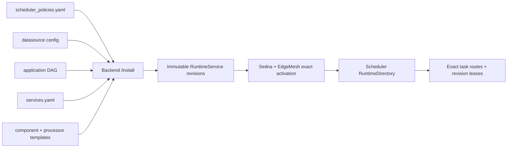

# Repository Quickstart

This page is for readers who have already found the public Dayu documentation site and now need to work inside this
repository. End-user onboarding, cluster preparation, walkthroughs, and case-study style explanations belong on the
[project documentation site](https://dayu-autostreamer.github.io/docs/). This repository page stays close to code,
contracts, and local validation.

## What This Page Is For

Use this page when you need to:

- find the implementation path for a code change
- run repository-local validation before a patch or release
- connect a runtime behavior back to templates, hooks, backend routes, or tests
- decide which repository reference document must change with code

If the task is "install Dayu for the first time" or "run the public tutorial," start from the website instead.

## Repository Mental Model

Dayu turns user intent into a coordinated cloud-edge runtime:

1. `dayu.sh` starts the platform support layer and backend-only Kubernetes RBAC.
2. Backend `/install` combines a scheduler policy, datasource config, DAG workflow, service catalog, and templates into
   immutable Sedna RuntimeServices.
3. Scheduler publishes a Redis-backed, versioned RuntimeDirectory; runtime components coordinate tasks through exact
   task routes and revision leases without Kubernetes discovery.
4. Backend query and visualization APIs expose the running system to the frontend and operators.

For the exact vocabulary and contract boundaries, read [`concepts.md`](./concepts.md) before changing code.

## Local Validation

Use the repository-declared toolchain:

| Tool | Declared by |
| --- | --- |
| Python `3.8` | [`.python-version`](../.python-version) |
| Node.js `20` | [`.nvmrc`](../.nvmrc) |
| Python developer dependencies | [`requirements-dev.txt`](../requirements-dev.txt) |
| Make targets | [`Makefile`](../Makefile) |

Common validation commands:

```bash
make install-python-dev
make validate-build
make lint-python
make python-syntax
make test-unit-integration
make test-component
make test-e2e
make frontend-install
make frontend-check
```

`make check` runs the day-to-day aggregate gate. It includes build-matrix validation, Python CI checks, and frontend
checks. It does not build Docker images.

## Implementation Reading Path

| If you are changing... | Read first |
| --- | --- |
| Core terms, DAG/service semantics, or the task content envelope | [`concepts.md`](./concepts.md) |
| Control-plane/runtime architecture | [`architecture/README.md`](./architecture/README.md) |
| Scheduler policies, templates, env vars, or processor deployment knobs | [`configuration/README.md`](./configuration/README.md) |
| Backend routes or internal runtime APIs | [`api/README.md`](./api/README.md) |
| Install, query, redeployment, or cleanup behavior | [`operations/README.md`](./operations/README.md) |
| Hook registration, lifecycle, or built-in aliases | [`hooks/README.md`](./hooks/README.md) and [`hooks/catalog.md`](./hooks/catalog.md) |
| Datasource manifests or playback behavior | [`datasource/README.md`](./datasource/README.md) |
| Test placement or local gates | [`testing/README.md`](./testing/README.md) |

## Runtime Inputs Worth Knowing

Most implementation debugging eventually touches these inputs:

| Input | Example location | What it controls |
| --- | --- | --- |
| Scheduler policy | [`template/scheduler_policies.yaml`](../template/scheduler_policies.yaml) | Which scheduler template and dependent component templates are installed. |
| Datasource config | [`config/datasource_configs/road_and_street_http.yaml`](../config/datasource_configs/road_and_street_http.yaml) | Source labels, source mode, source paths or URLs, and source metadata. |
| DAG workflow | [`config/application_dags/driving_risk_perception.dag`](../config/application_dags/driving_risk_perception.dag) | Which processor services run and how their outputs flow to downstream services. |
| Service catalog | [`template/services.yaml`](../template/services.yaml) | Which logical services exist and which processor template they use. |



The support layer may use `JointMultiEdgeService`; application workers do not. Backend modules under `backend/runtime_*`
are the sole cluster-access path, while `dependency/core/lib/runtime/` is deliberately pure Python.

## Documentation Boundary

Keep public tutorials and repository references separate:

| Belongs on the website | Belongs in this repository |
| --- | --- |
| first-time installation narrative | exact script inputs and lifecycle behavior |
| UI walkthroughs and screenshots | backend and runtime API contracts |
| public examples and case studies | template schemas, hook aliases, and datasource contracts |
| conceptual product positioning | code-facing architecture and extension seams |
| release-facing user guidance | tests, local checks, and maintainer change rules |
